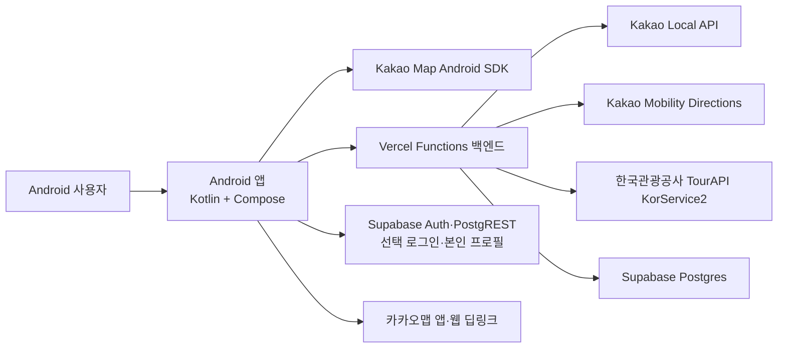
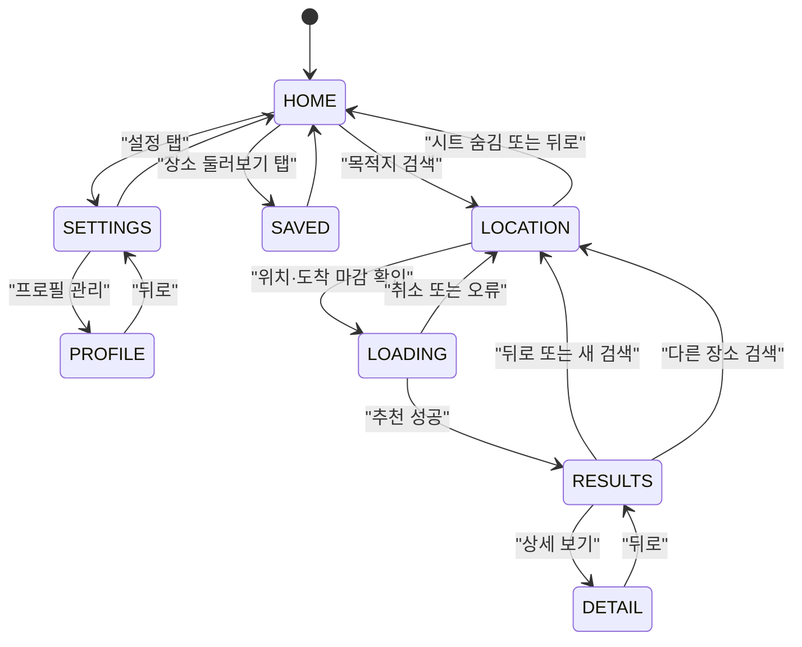
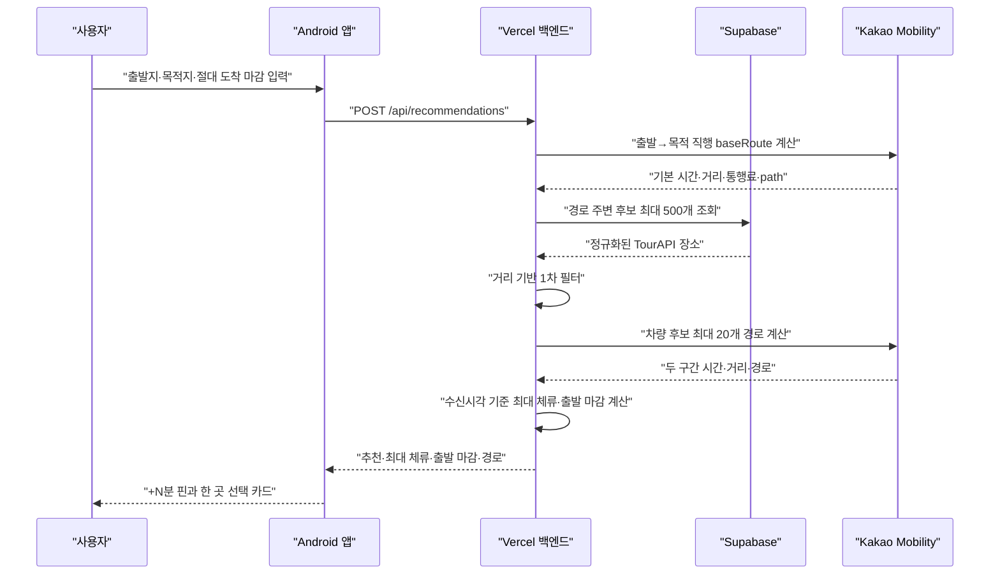
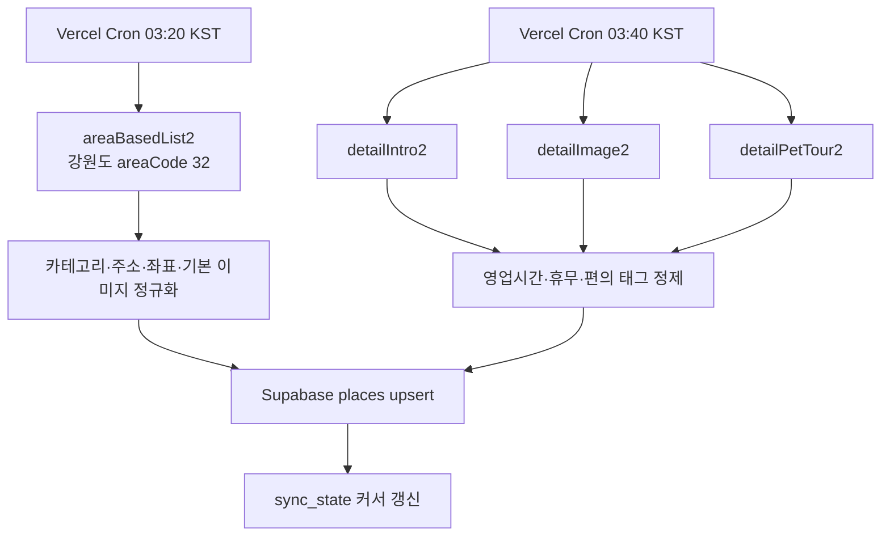

# 시스템 아키텍처

## 1. 전체 구성



Android에는 카카오 네이티브 지도 키와 Supabase Project URL·publishable key만
주입합니다. TourAPI 서비스키, Kakao REST 키와 Supabase service role key는
백엔드 환경변수에만 둡니다.

## 2. 저장소 모듈

### `android/`

- Single Activity Android 앱
- Jetpack Compose UI
- `AppDestination` enum 기반 수동 화면 전환
- `HttpURLConnection`과 `JSONObject` 기반 API 클라이언트
- Kakao Map Android SDK 지도
- Android `LocationManager` 기반 위치
- Room·Flow 기반 기기 로컬 저장 장소
- SharedPreferences는 홈 안내 날짜 같은 단순 기기 설정과 1회성 저장 데이터 이전에만 사용

주요 파일:

| 경로 | 책임 |
|---|---|
| `android/app/src/main/java/com/tteumsae/app/MainActivity.kt` | Compose 진입점 |
| `android/app/src/main/java/com/tteumsae/app/TteumsaeApplication.kt` | Kakao 지도 SDK·앱 데이터 컨테이너 초기화 |
| `android/app/src/main/java/com/tteumsae/app/AppContainer.kt` | Room, 인증·프로필·계정 삭제 Repository 단일 생성 |
| `android/app/src/main/java/com/tteumsae/app/data/auth/` | 선택형 Supabase PKCE 세션과 exact 딥링크 어댑터 |
| `android/app/src/main/java/com/tteumsae/app/data/profile/` | 본인 프로필 RLS 조회·생성·수정 |
| `android/app/src/main/java/com/tteumsae/app/data/account/` | 검증된 토큰 기반 계정 삭제 HTTP 클라이언트 |
| `android/app/src/main/java/com/tteumsae/app/data/local/` | 저장 장소 Room 엔티티·DAO·스냅샷·기존 JSON 이전 |
| `android/app/src/main/java/com/tteumsae/app/data/saved/SavedPlacesRepository.kt` | 게스트 저장·해제·복원·전체 비우기 진입점 |
| `android/app/src/main/java/com/tteumsae/app/ui/saved/` | 장소 탐색·저장 목록과 카탈로그 상세 UI |
| `android/app/src/main/java/com/tteumsae/app/ui/settings/` | 설정 UI와 기기 로컬 저장 안내 |
| `android/app/src/main/java/com/tteumsae/app/ui/account/` | 로그인 시트, 프로필 편집, 탈퇴 확인과 AccountViewModel |
| `android/app/src/main/java/com/tteumsae/app/ui/TteumsaeApp.kt` | 루트 화면 조립, 홈·상세·공용 지도 연결 |
| `android/app/src/main/java/com/tteumsae/app/ui/route/` | 경로 입력·결과 UI와 `RouteFlowViewModel` 상태 소유권 |
| `android/app/src/main/java/com/tteumsae/app/domain/route/` | 도착 마감 검증·표시 계산·경로 입력 모델 |
| `android/app/src/main/java/com/tteumsae/app/data/route/` | 신규 추천 계약을 감싼 `RouteGateway` |
| `android/app/src/main/java/com/tteumsae/app/reminder/` | 선택형 출발 알림 저장·예약·수신과 새 검색/재조회 수명주기 조정 |
| `android/app/src/main/java/com/tteumsae/app/ui/CurrentLocation.kt` | 위치 권한 이후 좌표 취득 |
| `android/app/src/main/java/com/tteumsae/app/data/TteumsaeApi.kt` | 백엔드 HTTP 호출과 JSON 파싱 |
| `android/app/src/main/java/com/tteumsae/app/domain/Models.kt` | 앱 도메인 모델 |
| `android/app/src/main/java/com/tteumsae/app/ui/theme/Theme.kt` | 브랜드 색상과 Compose 테마 |

Gate 2에서 경로 입력, 결과와 상태를 `ui/route`로 분리하고 `TteumsaeApp.kt`의
기존 조건·복수 선택 화면을 제거했습니다. 공용 Kakao 지도 구현과 홈·상세 조립은
아직 루트 파일에 남아 있으므로 이후에도 수정하는 화면부터 점진 분리합니다.

### `backend/`

- Node.js 24.x
- Vercel Functions
- 런타임 외부 의존성 없이 표준 `fetch` 사용
- Node 내장 테스트 러너
- Supabase REST API로 DB 접근
- TourAPI 동기화 Cron
- Kakao 검색·역지오코딩·차량 경로

주요 파일:

| 경로 | 책임 |
|---|---|
| `backend/api/recommendations.js` | 추천 요청 오케스트레이션 |
| `backend/api/route.js` | 선택 경유지 0~5개의 통합 차량 경로 재계산 |
| `backend/api/geocode.js` | 카카오 키워드 장소 검색 |
| `backend/api/region.js` | 좌표의 행정구역·강원도 판별 |
| `backend/api/places/` | 장소 목록·상세 |
| `backend/api/cron/` | TourAPI 기본·상세 동기화 |
| `backend/lib/tour-api.js` | TourAPI 호출·정규화 |
| `backend/lib/kakao-mobility.js` | 자동차 경로 계산 |
| `backend/lib/time-safe.js` | 시간 안전 필터와 운영상태 |
| `backend/lib/database.js` | Supabase 조회·upsert |
| `backend/migrations/` | DB 스키마 |

### `download/`

Vercel의 별도 `tteumsae-apk` 프로젝트에 배포하는 정적 HTML입니다. Git에는 HTML만 보관하고 APK는 보관하지 않습니다.

## 3. Android 화면 상태



화면 enum은 루트가 관리하지만 경로 입력과 선택 ID는 `RouteFlowViewModel`과
`SavedStateHandle`이 소유합니다. 출발·목적 좌표, 절대 도착 마감, 이동수단,
선택 필터와 선택 장소 ID를 복원합니다. 추천 결과 payload는 재요청이 필요한
네트워크 결과라 영구 복원하지 않으며, payload 없는 RESULTS/DETAIL은 안전한 입력
화면으로 되돌립니다. Navigation Compose는 아직 사용하지 않습니다.

## 4. 추천 요청 흐름



도보 모드는 Kakao Mobility가 아닌 직선거리 기반 추정값을 사용하고 경고문을 응답합니다.

## 5. TourAPI 데이터 파이프라인



Vercel Cron 설정은 UTC `18:20`, `18:40`이며 한국시간으로 다음 날 오전 `03:20`, `03:40`입니다.

현재 상세 동기화 기본 배치는 하루 10개 장소이므로 전체 갱신에 오래 걸릴 수 있습니다.

## 6. 시간 안전 계산

`ARRIVAL_DEADLINE_V1` 한 장소의 기본 판단:

```text
remainingMinutes = floor((arrivalDeadlineEpochMillis - serverReceivedAt) / 60초)
maximumStayMinutes = floor5(remainingMinutes - firstLegMinutes - secondLegMinutes - 10)
추천 조건 = maximumStayMinutes >= 15
latestDepartureAt = arrivalDeadline - secondLegMinutes - 10분
```

차량 모드:

- 출발→목적 직행 `baseRoute`와 출발→후보→목적 경로 모두 Kakao Mobility
  응답을 사용합니다.
- Android는 사용자가 고른 절대 epoch와 `timeModel=ARRIVAL_DEADLINE_V1`만 보내며
  안전여유를 입력받거나 전송하지 않습니다. 서버가 10분을 고정 적용합니다.
- 운영시간이 명확하면 최대 체류를 영업 종료에 맞춰 줄이고, 해석 불가
  `UNKNOWN`은 후보로 유지해 확인 필요 상태를 표시합니다.
- 교통과 외부 내비 재계산이 달라질 수 있으므로 정시 도착을 보장한다고 표현하지 않습니다.

도보 모드:

- 직선거리와 보수적인 속도 가정으로 계산합니다.
- 실제 보행 경로, 횡단보도와 고도 차이는 반영하지 않습니다.

## 7. 한 곳 선택과 하위 호환

추천 단계는 후보 하나씩 출발→후보→목적 경로를 평가합니다. 활성 결과 UI는
선택 없음 또는 한 곳만 허용하며 같은 장소를 다시 누르면 해제하고 다른 장소를
누르면 교체합니다. 카카오맵에는 선택한 한 곳과 최종 목적지를 전달합니다.

`POST /api/route`와 Android 저수준 route wrapper의 0~5개 경유지 계약은 기존
클라이언트 회귀를 막기 위해 유지합니다. 신규 화면은 이 복수 선택 기능을 호출하지
않습니다. 앱 계산과 별개로 최종 안내 경로는 카카오맵에서 다시 계산됩니다.

## 8. 붉은 후보 영역

결과 지도에서 붉은 영역은 실제 등시간선이 아닙니다.

- 직행 `baseRoute.path`를 기준선으로 사용합니다.
- 경로상의 여러 원을 겹쳐 영역처럼 표시합니다.
- 반경은 `(남은 분 - 직행 분) × 20m`, 최소 800m, 최대 8km입니다. 신규 흐름의
  남은 분은 서버 수신시각과 절대 도착 마감으로 계산합니다.

다음 버전에서 실제 corridor API나 서버의 경로 거리 조건으로 교체하기 전까지 `탐색 후보 범위` 수준으로만 설명해야 합니다.

## 9. 장소 저장과 이미지

- 저장 장소의 단일 원본은 Android Room의 `saved_places` 테이블이며 UI는 lifecycle-aware Flow로 관찰합니다.
- 현재 활성 범위는 `GUEST`뿐이고 계정이나 서버와 동기화하지 않습니다. 게스트 행은 네트워크 작업을 만들지 않습니다.
- 로그인 사용자의 원격 `user_saved_places` 테이블과 RLS는 준비됐지만 Room과의
  동기화는 별도 후속 계획이며, 현재 설정 UI가 이를 완료된 기능처럼 표시하지 않습니다.
- 저장 해제와 전체 비우기는 행을 즉시 삭제하지 않고 `desired_saved=false` tombstone으로 남깁니다.
- 저장 스냅샷에는 장소명, 분류, 내부 기본 체류값, 주소, 좌표, 이미지 URL, 태그,
  운영시간과 휴무일을 포함합니다. 기본 체류값은 호환 데이터로 보관하지만 사용자
  UI에는 평균 체류로 표시하지 않습니다. 추천 시점의 경로 시간·거리는 저장하지 않습니다.
- 앱 업데이트 시 기존 `saved_places/entries` JSON은 Room 트랜잭션 성공 후 한 번만 이전·제거합니다.
- SharedPreferences는 홈 안내 날짜 등 단순 기기 설정에만 계속 사용합니다.
- 활성 여행 좌표와 인증 세션이 들어갈 수 있는 SharedPreferences 전체는 cloud backup과
  device transfer에서 제외합니다. Room 저장 장소는 이 제외 대상과 별개입니다.
- 이미지는 앱에서 직접 내려받아 메모리 `LruCache`에 보관합니다.
- 이미지가 없거나 실패하면 앱이 그린 기본 장소 이미지를 표시합니다.

## 10. 외부 키 경계

| 키 | 위치 | Android 포함 여부 |
|---|---|---|
| Kakao Native App Key | `android/local.properties` | 포함됨 |
| Supabase URL / publishable key | `android/local.properties` | 포함됨(공개 클라이언트 설정) |
| TourAPI 서비스키 | Vercel 환경변수 | 포함 안 됨 |
| Kakao REST API Key | Vercel 환경변수 | 포함 안 됨 |
| Supabase Service Role Key | Vercel 환경변수 | 포함 안 됨 |
| Cron Secret | Vercel 환경변수 | 포함 안 됨 |

카카오 네이티브 앱 키는 APK에 포함되는 성격이므로 Kakao Developers에서 패키지명과 키 해시를 제한해야 합니다.

## 11. 미사용 코드 경계

다음 Android 코드는 현재 운영 흐름에 연결되지 않습니다.

- `SearchMode.NEARBY`, 도보 추천과 legacy 상대시간 직렬화 경로
- 저수준 `/api/route` 복수 경유지 호환 wrapper
- `data/DataContracts.kt`의 저장소·경로 인터페이스와 샘플 구현
- `data/SamplePlaces.kt`
- `domain/TimeSafeEngine.kt`

실제 추천은 Vercel 백엔드가 수행합니다. 오프라인 데모 계획이 없다면 이 파일은 제거 후보이며, 운영 알고리즘으로 확장하지 않습니다.
