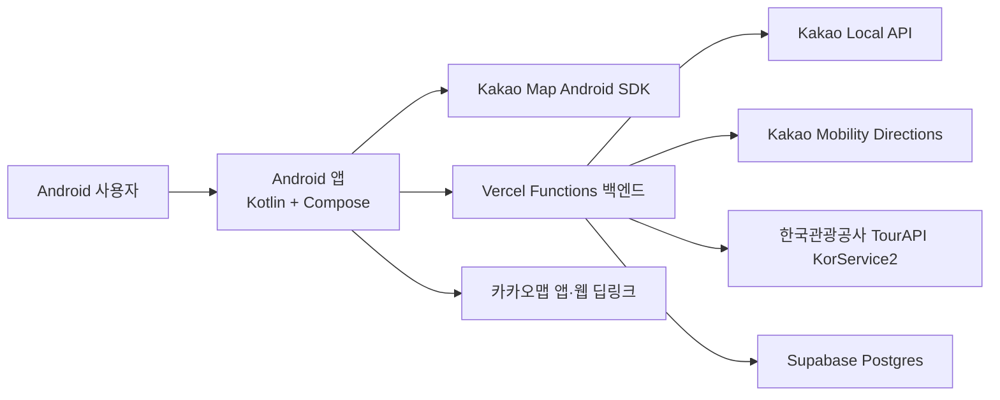
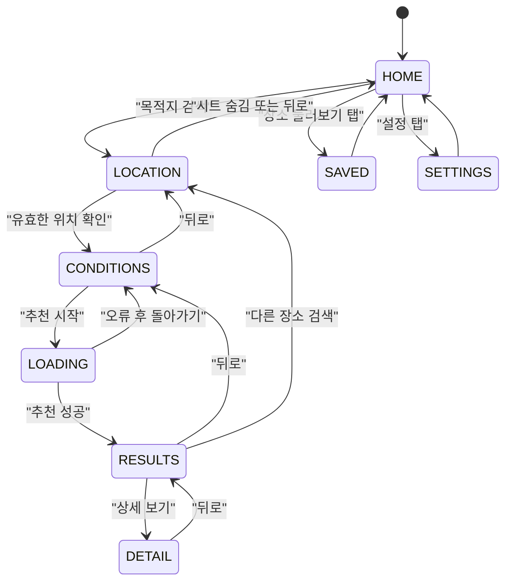
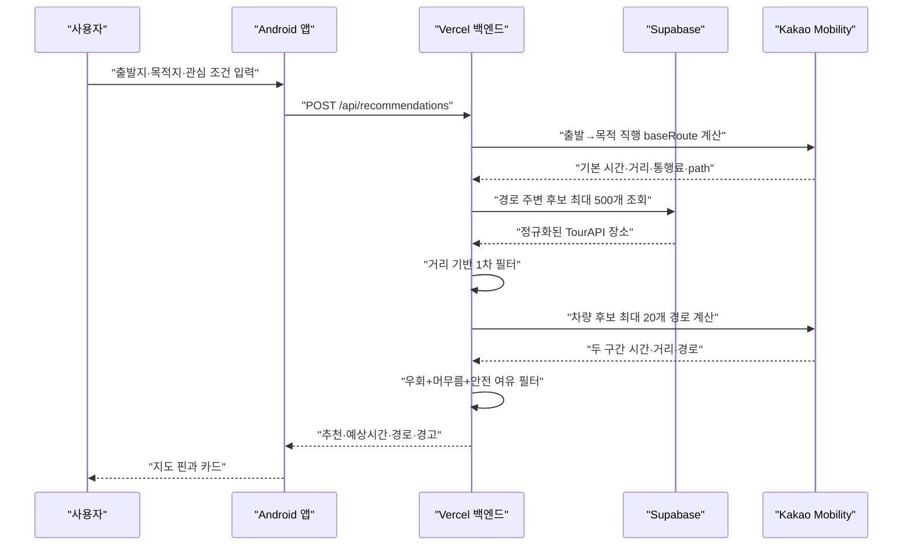
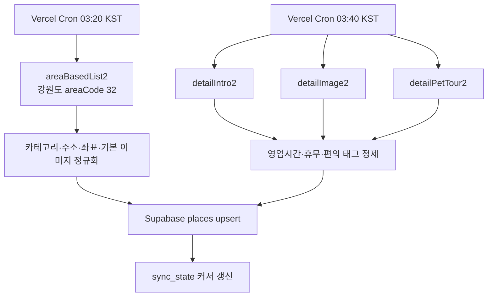

# 시스템 아키텍처

## 1. 전체 구성



Android에는 카카오 네이티브 지도 키만 주입합니다. TourAPI 서비스키, Kakao REST 키와 Supabase 서비스 역할 키는 백엔드 환경변수에만 둡니다.

## 2. 저장소 모듈

### `android/`

- Single Activity Android 앱
- Jetpack Compose UI
- `AppScreen` enum 기반 수동 화면 전환
- `HttpURLConnection`과 `JSONObject` 기반 API 클라이언트
- Kakao Map Android SDK 지도
- Android `LocationManager` 기반 위치
- SharedPreferences JSON 기반 저장 장소

주요 파일:

| 경로 | 책임 |
|---|---|
| `android/app/src/main/java/com/tteumsae/app/MainActivity.kt` | Compose 진입점 |
| `android/app/src/main/java/com/tteumsae/app/TteumsaeApplication.kt` | Kakao 지도 SDK 초기화 |
| `android/app/src/main/java/com/tteumsae/app/ui/TteumsaeApp.kt` | 화면, 상태, 지도, 딥링크 대부분 |
| `android/app/src/main/java/com/tteumsae/app/ui/CurrentLocation.kt` | 위치 권한 이후 좌표 취득 |
| `android/app/src/main/java/com/tteumsae/app/data/TteumsaeApi.kt` | 백엔드 HTTP 호출과 JSON 파싱 |
| `android/app/src/main/java/com/tteumsae/app/domain/Models.kt` | 앱 도메인 모델 |
| `android/app/src/main/java/com/tteumsae/app/ui/theme/Theme.kt` | 브랜드 색상과 Compose 테마 |

현재 `TteumsaeApp.kt`가 약 4,179줄이며 앱 전체 상태와 대부분의 화면을 함께 관리합니다. 기능형 MVP에는 동작하지만 다음 버전에서 화면·상태를 계속 추가하기에는 위험합니다.

### `backend/`

- Node.js 20 이상
- Vercel Functions
- 런타임 외부 의존성 없이 표준 `fetch` 사용
- Node 내장 테스트 러너
- Supabase REST API로 DB 접근
- TourAPI 동기화 Cron
- Kakao 검색·역지오코딩·차량 경로

주요 파일:

| 경로 | 책임 |
|---|---|
| `backend/api/recommendations.js` | 추천 요청 오케스트레이션 |
| `backend/api/route.js` | 선택 경유지 0~5개의 통합 차량 경로 재계산 |
| `backend/api/geocode.js` | 카카오 키워드 장소 검색 |
| `backend/api/region.js` | 좌표의 행정구역·강원도 판별 |
| `backend/api/places/` | 장소 목록·상세 |
| `backend/api/cron/` | TourAPI 기본·상세 동기화 |
| `backend/lib/tour-api.js` | TourAPI 호출·정규화 |
| `backend/lib/kakao-mobility.js` | 자동차 경로 계산 |
| `backend/lib/time-safe.js` | 시간 안전 필터와 운영상태 |
| `backend/lib/database.js` | Supabase 조회·upsert |
| `backend/migrations/` | DB 스키마 |

### `download/`

Vercel의 별도 `tteumsae-apk` 프로젝트에 배포하는 정적 HTML입니다. Git에는 HTML만 보관하고 APK는 보관하지 않습니다.

## 3. Android 화면 상태



상태는 `TteumsaeApp()`의 Compose `remember`와 `rememberSaveable` 변수로 관리합니다. ViewModel, Navigation Compose와 DI는 사용하지 않습니다.

일부 객체는 `remember`만 사용하므로 프로세스가 종료된 뒤 화면 enum만 복원되고 좌표·추천 결과가 사라지는 상태 불일치가 발생할 수 있습니다.

## 4. 추천 요청 흐름



도보 모드는 Kakao Mobility가 아닌 직선거리 기반 추정값을 사용하고 경고문을 응답합니다.

## 5. TourAPI 데이터 파이프라인



Vercel Cron 설정은 UTC `18:20`, `18:40`이며 한국시간으로 다음 날 오전 `03:20`, `03:40`입니다.

현재 상세 동기화 기본 배치는 하루 10개 장소이므로 전체 갱신에 오래 걸릴 수 있습니다.

## 6. 시간 안전 계산

한 장소의 기본 판단:

```text
effectiveDeadlineMinutes = baseRouteMinutes + extraTimeMinutes
detourMinutes = candidateRouteMinutes - baseRouteMinutes
추천 조건 = detourMinutes + stayMinutes + safetyBufferMinutes <= extraTimeMinutes
```

차량 모드:

- 출발→목적 직행 `baseRoute`와 출발→후보→목적 경로 모두 Kakao Mobility
  응답을 사용합니다.
- 활성 Android 흐름에는 시간 입력 화면이 없습니다. 추천 API 호환을 위해
  `extraTimeMinutes=1,440`, `safetyBufferMinutes=15`를 내부 고정값으로
  전송합니다. 백엔드의 `deadlineMinutes`는 이전 클라이언트 호환용입니다.
- 따라서 이 값은 사용자의 실제 도착 마감이나 남은 시간이 아니며 현재 앱을
  `늦지 않음 보장`으로 설명하면 안 됩니다.

도보 모드:

- 직선거리와 보수적인 속도 가정으로 계산합니다.
- 실제 보행 경로, 횡단보도와 고도 차이는 반영하지 않습니다.

## 7. 복수 경유지 선택

추천 단계에서는 후보 하나씩의 경로를 평가합니다. 결과에서 사용자가 경유지를
선택하면 다음 방식으로 전체 경로를 갱신합니다.

1. 선택 0개는 직행 `baseRoute`를 유지합니다.
2. 1~5개는 사용자가 추가한 순서를 유지해 `POST /api/route`로 보냅니다.
3. 백엔드는 출발지→선택 경유지→목적지 전체를 Kakao Mobility로 계산해
   시간·거리·통행료·legs·path를 반환합니다.
4. 요청 실패 시에만 Android가 단일 후보 우회값을 합친 예상 fallback을
   표시합니다.
5. 최대 5개 경유지와 최종 목적지를 같은 순서로 카카오맵 URL에 전달합니다.

앱의 통합 경로와 별개로 최종 안내 경로는 카카오맵이 열린 후 다시 계산합니다.

## 8. 붉은 후보 영역

결과 지도에서 붉은 영역은 실제 등시간선이 아닙니다.

- 직행 `baseRoute.path`를 기준선으로 사용합니다.
- 경로상의 여러 원을 겹쳐 영역처럼 표시합니다.
- 반경은 `extraTimeMinutes × 20m`, 최소 800m, 최대 8km입니다. 현재 내부값은
  1,440분이므로 활성 흐름에서는 최대 8km가 됩니다.

다음 버전에서 실제 corridor API나 서버의 경로 거리 조건으로 교체하기 전까지 `탐색 후보 범위` 수준으로만 설명해야 합니다.

## 9. 장소 저장과 이미지

- 저장 장소는 Android SharedPreferences에 JSON으로 저장합니다.
- 계정이나 서버와 동기화하지 않습니다.
- 저장 데이터에는 장소명, 주소, 좌표, 이미지 URL과 태그가 포함됩니다.
- 이미지는 앱에서 직접 내려받아 메모리 `LruCache`에 보관합니다.
- 이미지가 없거나 실패하면 앱이 그린 기본 장소 이미지를 표시합니다.

## 10. 외부 키 경계

| 키 | 위치 | Android 포함 여부 |
|---|---|---|
| Kakao Native App Key | `android/local.properties` | 포함됨 |
| TourAPI 서비스키 | Vercel 환경변수 | 포함 안 됨 |
| Kakao REST API Key | Vercel 환경변수 | 포함 안 됨 |
| Supabase Service Role Key | Vercel 환경변수 | 포함 안 됨 |
| Cron Secret | Vercel 환경변수 | 포함 안 됨 |

카카오 네이티브 앱 키는 APK에 포함되는 성격이므로 Kakao Developers에서 패키지명과 키 해시를 제한해야 합니다.

## 11. 미사용 코드 경계

다음 Android 코드는 현재 운영 흐름에 연결되지 않습니다.

- `ui/TteumsaeApp.kt`의 `TimeScreen`, `TimeSliderThumb`, `ModeSelector`
- `data/DataContracts.kt`의 저장소·경로 인터페이스와 샘플 구현
- `data/SamplePlaces.kt`
- `domain/TimeSafeEngine.kt`

실제 추천은 Vercel 백엔드가 수행합니다. 오프라인 데모 계획이 없다면 이 파일은 제거 후보이며, 운영 알고리즘으로 확장하지 않습니다.
