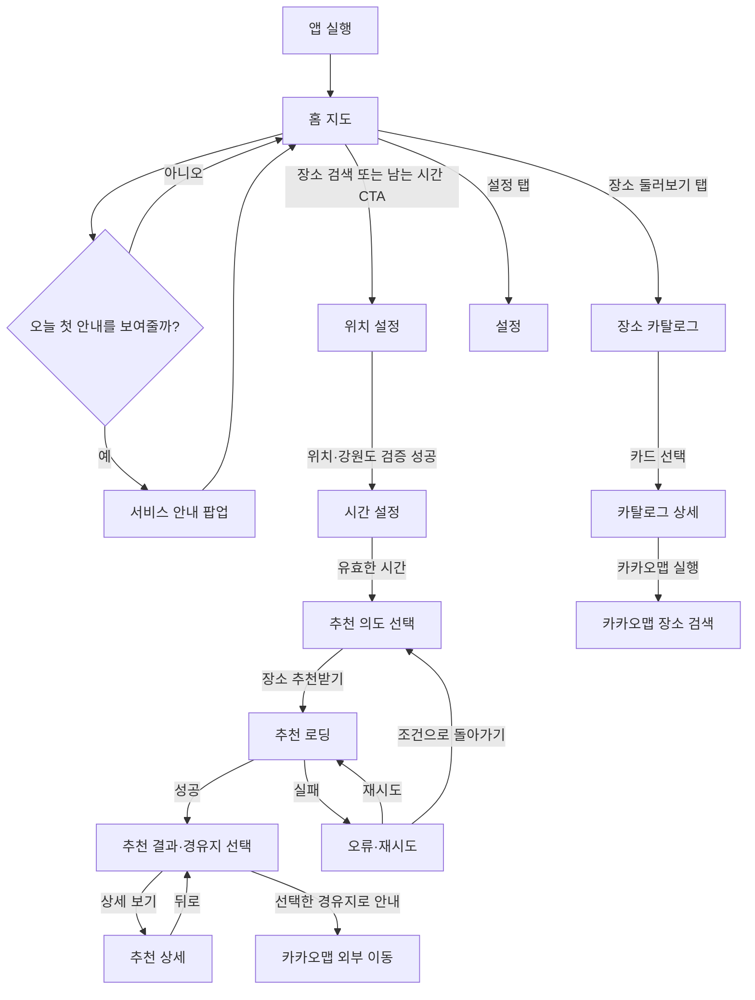
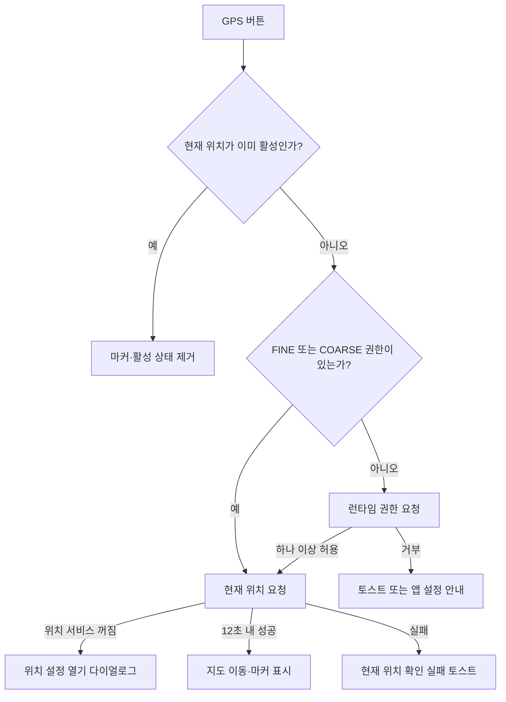
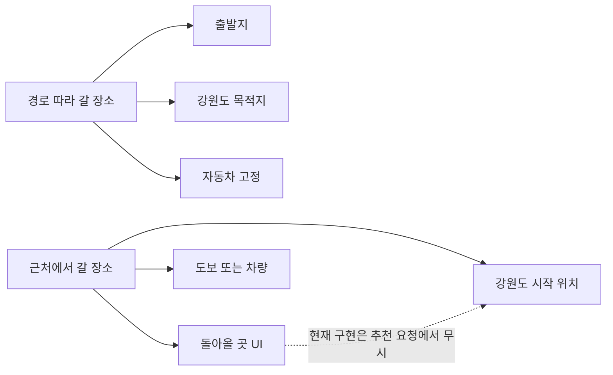
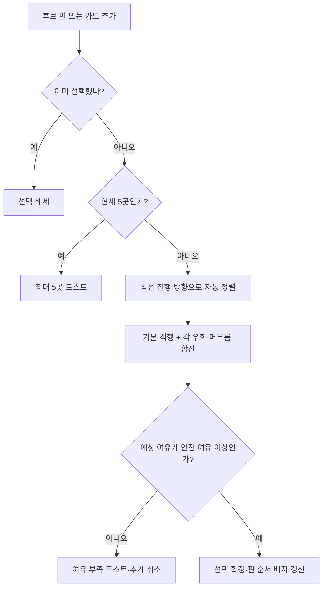

# 화면 흐름과 상태 전이

기준일: `2026-08-16`
검토 기준: `android/`의 현재 구현
주요 화면 구현: `../android/app/src/main/java/com/tteumsae/app/ui/TteumsaeApp.kt`

이 문서는 새 담당자가 화면을 수정할 때 **어디에서 진입하고, 어떤 상태를 읽고 쓰며, 어떤 API를 호출하고, 실패 시 어디에 머무르는지** 확인하기 위한 실행 명세입니다. 디자인 시안과 다른 부분도 현재 코드 동작을 우선 기록했습니다.

## 1. 전체 화면 구조

앱은 Navigation Compose를 사용하지 않습니다. `TteumsaeApp()` 안의 `AppScreen` 값으로 한 화면을 교체합니다.



### 앱 전역 상태

| 상태 | 초기값 | 변경 화면 | 수명·주의점 |
|---|---:|---|---|
| `screen` | `HOME` | 모든 화면 | `rememberSaveable`; 앱 내부 백스택이 아니라 단일 enum |
| `mode` | `ON_THE_WAY` | 위치 설정 | `rememberSaveable` |
| `startName`, `endName` | `현재 위치`, 빈 문자열 | 홈·위치 | 문자열만 saveable |
| `startLocation`, `endLocation` | `null` | 홈·위치·로딩 | 좌표 객체는 `remember`; 프로세스/구성 변경 복원 주의 |
| `deadline` | 90분 | 시간·빈 결과 | `rememberSaveable`, 직접 입력 최대 1440분 |
| `buffer` | 15분 | 시간 | `rememberSaveable` |
| `transport` | 차량 | 위치·시간 | 경로 모드에서는 항상 차량으로 다시 강제 |
| `categories`, `excludeRestaurants` | 없음, false | 조건·빈 결과 | 카테고리는 `remember`, 음식 제외는 saveable |
| `recommendations`, `warning`, `activeCriteria` | 빈 값 | 로딩 | 메모리 전용. 결과 화면이 참조 |
| `currentLocationTarget` | `null` | 홈·위치 | 홈 지도 GPS 활성 상태와 마커 위치. 메모리 전용 |
| `savedPlaces` | SharedPreferences 로드 | 상세·둘러보기·설정 | 변경 즉시 로컬 JSON으로 저장 |
| `catalogPlaces`와 페이지 | 빈 목록, 1 | 장소 둘러보기 | 메모리 전용. 탭에 다시 진입하면 첫 페이지부터 다시 로드 |

## 2. 공통 지도 바텀시트 규칙

위치·시간·조건 화면은 `MapSheetScreen`을 공유합니다.

- 배경: Kakao Map Android SDK 지도. 별도 좌표가 없으면 강릉 기본 위치.
- 시트 기본 노출 높이: 화면 높이의 54%.
- 시트 최대 콘텐츠 높이: 화면 높이의 90%.
- 드래그 손잡이로 확장·축소·완전 숨김 가능.
- 시트가 `Hidden`이 되면 화면별 `onBack`을 호출합니다.
- 하단 이전/다음 CTA는 시트가 보이는 동안 화면 하단에 고정하고, 시트를 완전히 숨기면 함께 제거합니다.
- 콘텐츠는 CTA 높이를 피해 하단 112dp 여백을 둡니다.

공통 지도 상태:

- `KAKAO_MAP_NATIVE_APP_KEY`가 비어 있으면 플레이스홀더와 `카카오맵 앱 키 설정이 필요합니다.` 표시.
- SDK 지도 오류는 중앙 메시지와 `지도 다시 시도` 버튼 표시.
- 지도 재시도는 `MapView`를 새로 만들고 SDK start를 다시 수행.

코드: `ui/TteumsaeApp.kt`의 `MapSheetScreen`, `MapBackground`, `KakaoMapSurface`.

## 3. 앱 시작과 홈

### 진입

- `MainActivity`가 `TteumsaeTheme` 안에서 `TteumsaeApp()` 실행.
- 기본 화면 `HOME`, 기본 모드 `ON_THE_WAY`.
- 기본 지도는 강릉 중심.

### 첫 안내 팝업

1. SharedPreferences `home_intro.hidden_date`와 오늘 날짜 비교.
2. 날짜가 다르거나 값이 없으면 팝업 표시.
3. `오늘 하루 보지 않기`를 체크하고 `확인`하면 오늘 날짜 저장.
4. 배경 dismiss는 오늘 숨김을 저장하지 않고 현재 세션에서만 닫음.

### 홈 UI와 액션

| UI | 액션 | 결과 상태 |
|---|---|---|
| 상단 `장소 검색` | 탐색 시작 | 홈 GPS 좌표가 있으면 출발 좌표로 전달, 위치 설정으로 이동 |
| 하단 `남는 시간으로 장소 찾기` | 위와 동일 | 위치 설정으로 이동 |
| 우하단 GPS 버튼 비활성 | 권한 확인→현재 위치 요청 | 성공 시 지도 줌 16 이동, 빨간 현재 위치 마커, 버튼 빨간 활성 상태 |
| 우하단 GPS 버튼 활성 | 현재 위치 선택 해제 | 마커 제거, 기본 검정 버튼 상태. 카메라는 자동으로 기본 위치에 복귀하지 않음 |
| 하단 탭 | 루트 이동 | 장소 둘러보기 또는 설정으로 화면 교체 |

### GPS 분기



현재 위치 공급 순서:

1. FINE 권한이면 GPS provider 후보 추가.
2. Network provider 사용 가능 시 후보 추가.
3. 후보 중 60초 이내 마지막 위치가 있으면 즉시 성공.
4. 아니면 각 provider에 single update 요청.
5. 12초 후 마지막 위치라도 있으면 사용하고, 없으면 실패.

코드: `ui/CurrentLocation.kt`, `ui/TteumsaeApp.kt`의 `HomeScreen`.

### 뒤로가기

- 홈에는 앱 내부 이전 화면이 없음.
- 앱 자체 `BackHandler`가 없으므로 시스템 뒤로가기는 Activity/Material 기본 동작에 의존합니다.

## 4. 위치 설정

### 진입 상태

- 홈에서 GPS 좌표를 전달받았으면 `startLocation.id = current-location`.
- GPS 좌표가 없으면 `startName = 현재 위치`, `startLocation = null`이며 화면 진입 효과가 자동으로 현위치 요청을 시작.
- 경로 모드면 목적지는 빈 값.
- 근처 모드면 종료 위치를 시작 위치와 동일하게 맞춤.

### 모드 전환



#### 경로 따라 갈 장소

- 출발지 검색은 전국 범위.
- 목적지 검색은 검색어 앞에 `강원 `을 붙여 요청.
- 다음 단계 직전 `/api/region`으로 목적지가 실제 강원도인지 재검사.
- 이동수단은 차량으로 고정.

#### 근처에서 갈 장소

- 시작과 돌아올 곳 검색 모두 강원도 범위.
- 모드 전환 순간 종료 위치를 시작 위치와 같게 설정.
- `시작 위치로 돌아오기` 버튼으로 다시 동일 위치 복사 가능.
- **현재 불일치:** 사용자가 다른 `돌아올 곳`을 선택할 수는 있지만 다음 단계 해석에서 `resolvedEnd = resolvedStart`로 덮어쓰므로 추천 API에는 반영되지 않습니다. 다음 버전에서 독립 복귀지를 지원하거나 두 번째 입력을 제거해야 합니다.

### 검색 필드 상태

| 상태 | 표시와 행동 |
|---|---|
| 미선택·0~1자 | 입력만 표시, API 호출 없음 |
| 미선택·2자 이상 | 350ms 대기 후 `/api/geocode`; 로딩 인디케이터 |
| 결과 있음 | 상위 5개 이름·주소 표시; 선택 시 좌표 저장 |
| 결과 없음 | `검색 결과가 없어요...` 안내 |
| 요청 실패 | 기능명+오류 메시지와 `다시 시도` |
| 선택 완료 | 한 줄 말줄임 텍스트; 텍스트를 누르면 선택 해제 후 포커스 |
| 현위치 선택 | `현위치` 버튼 빨간 활성; 다시 누르면 입력을 비우고 검색 상태로 전환 |

현재 위치 좌표가 들어오면 `/api/region`으로 주소를 역지오코딩합니다. 성공하면 화면의 `현재 위치`를 실제 주소로 교체하되 ID는 `current-location`으로 유지합니다. 역지오코딩 실패는 무시하고 기존 이름을 사용합니다.

### 다음 버튼 검증과 전이

`다음` 활성 조건:

- 시작 이름과 종료 이름이 비어 있지 않음.
- `현재 위치`라는 이름만 있고 좌표가 없는 상태가 아님.
- 위치 최종 확인 중이 아님.
- GPS 획득 중이 아님.

클릭 후 처리:

1. 저장된 좌표가 없으면 `/api/geocode`의 첫 결과로 다시 해석.
2. 경로 모드: 목적지를 별도 해석하고 `/api/region`으로 목적지 강원도 여부 확인.
3. 근처 모드: 시작을 종료로 복사하고 시작점 강원도 여부 확인.
4. 강원도 밖이면 설명 토스트 후 위치 화면 유지.
5. 성공하면 해석된 이름·좌표를 저장하고 시간 화면으로 이동.

### 뒤로가기

- 상단 화살표, 하단 `이전`, 시트 완전 숨김 모두 홈으로 이동.
- 시스템 뒤로가기용 앱 백스택은 정의하지 않음.

## 5. 시간 설정

### 진입

- 위치 검증 성공 후 진입.
- 기존 `deadline`, `buffer`, `transport` 값을 유지하므로 결과의 `조건 수정`으로 돌아왔을 때 이전 설정이 보임.

### 입력 규칙

| 항목 | 규칙 | 전이 영향 |
|---|---|---|
| 슬라이더 | 15~360분, 15분 단위 | 즉시 deadline과 텍스트 동기화 |
| 직접 입력 | 숫자 최대 4자리, 15~1440분 | 범위 밖이면 오류와 `다음` 비활성 |
| 경로 이동수단 | 자동차 고정 설명 카드 | `TransportMode.CAR` |
| 근처 이동수단 | 도보/차량 단일 선택 | 추천 요청에 전달 |
| 안전 여유 | 10/15/20/30분 | 추천 요청에 전달 |

화면은 `추천 장소에서 사용할 수 있는 시간 = max(deadline-buffer, 0)`을 안내합니다. 다만 `deadline <= buffer`를 차단하지 않으므로 서버에서 결과 없음이 발생할 수 있습니다.

현재 제목:

- 경로 모드: `목적지 도착까지 얼마나 시간이 남았나요?`
- 근처 모드: `돌아오기까지 얼마나 시간이 남았나요?`

기획에서 이를 순수한 여유시간 질문으로 바꾸려면 서버 `deadlineMinutes` 의미와 결과 문구도 동시에 갱신해야 합니다.

### 뒤로가기와 다음

- 하단 `이전` 또는 시트 숨김: 위치 설정.
- `다음`: 시간이 유효할 때 조건 화면.
- 시스템 뒤로가기 앱 처리 없음.

## 6. 추천 의도 선택

### 진입과 UI

- 현재 탐색 방식은 읽기 전용 카드로 표시.
- 추천 의도는 항상 하나만 선택.

| 선택 | 추천 API에 전달되는 카테고리 |
|---|---|
| 아무거나 | 빈 배열; 서버가 전체로 해석 |
| 식사 | `RESTAURANT` |
| 카페 | `CAFE` |
| 산책·관광 | `ATTRACTION`, `LEISURE` |
| 실내 활동 | `CULTURE`, `SHOPPING` |
| 지금은 음식 제외 | 모든 enum 카테고리에서 `RESTAURANT` 제외 |

`장소 추천받기`는 별도 필수 선택 없이 항상 활성화되어 있으며 현재 선택을 저장하고 로딩 화면으로 이동합니다.

### 뒤로가기

- `이전` 또는 시트 숨김: 시간 설정.
- 로딩 실패 화면의 `조건으로 돌아가기`도 이 화면으로 복귀.

## 7. 추천 로딩과 오류

### 성공 흐름

1. 출발/목적 좌표가 메모리에 없으면 `/api/geocode`로 보완.
2. `SearchCriteria`를 최종 이름·좌표로 복사.
3. `POST /api/recommendations` 호출.
4. 응답의 추천 목록과 `meta.warning` 저장.
5. 최소 500ms 대기 후 결과 화면 이동.

추천 요청 본문:

```json
{
  "mode": "ON_THE_WAY 또는 NEARBY",
  "start": { "latitude": 0.0, "longitude": 0.0 },
  "destination": { "latitude": 0.0, "longitude": 0.0 },
  "deadlineMinutes": 90,
  "safetyBufferMinutes": 15,
  "transport": "CAR 또는 WALK",
  "categories": ["ATTRACTION"]
}
```

### 실패 흐름

- 예외를 `장소 추천에 실패했어요. {원인}` 형식으로 표시.
- `다시 시도`: attempt 증가 후 같은 조건으로 전체 요청 재실행.
- `조건으로 돌아가기`: 조건 화면.
- 요청 진행 중에는 화면 내 취소/뒤로 버튼이 없음.

코드: `data/TteumsaeApi.kt`, `ui/TteumsaeApp.kt`의 `LoadingScreen`.

## 8. 추천 결과와 경유지 선택

### 진입

- 성공한 요청의 `activeCriteria`, 추천 목록, warning 사용.
- 결과가 있어도 자동 선택하지 않으며 `selectedIds`는 빈 배열로 시작.
- 출발·목적 이름이 바뀌면 선택 목록을 초기화.

### 화면 구성

1. 상단: 출발→목적, 남은 시간·안전 여유, `조건 수정`.
2. 지도: 대표 경로, 붉은 예상 영역, 후보 핀, 출발·도착 라벨.
3. 안내: 결과 유무, 서버 warning, 반영 카테고리.
4. 후보 카드 목록.
5. 결과가 있으면 하단 고정 경유지 상태와 카카오 안내 CTA.

### 지도 표현의 정확한 의미

- 대표 경로는 추천 목록에서 `detourMinutes`가 최소인 **한 후보의 routePoints**.
- routePoints가 없으면 출발→그 후보→목적 좌표를 직선으로 연결.
- 붉은 영역은 routePoints 일부마다 원을 그려 겹친 시각화.
- 원 반경은 `deadlineMinutes × 20m`, 800m~8km로 제한.
- 후보 핀은 서버 추천 중 위·경도가 있는 항목만 표시.
- 이 영역은 실시간 도로 등시간선이 아니며 선택한 복수 경유지 경로도 아닙니다.

### 경유지 선택 상태 전이



자동 정렬은 출발→목적 직선 벡터에 후보 좌표를 투영한 값입니다. 실제 도로 최적화가 아닙니다.

선택 시간은 다음 임시 계산을 사용합니다.

```text
기본 직행 예상 = 첫 선택 후보의 firstLeg + secondLeg - detour
선택 총 예상 = 기본 직행 예상 + Σ(각 후보 detour + stay)
선택 여유 = deadline - 선택 총 예상
```

서버/Kakao Mobility에 선택 조합을 재요청하지 않습니다. UI에는 확정 시간이 아니라 예상값으로 유지해야 합니다.

### 하단 CTA

- 선택 0곳: `경유지 0/5 선택`, 비활성 `지도에서 장소를 선택해 주세요`.
- 선택 1~5곳: `경유지 N/5 선택 · 약 X분 · Y분 여유`, 활성 `선택한 경유지로 안내`.
- CTA는 출발, 자동 정렬된 최대 5개 경유지, 최종 목적지를 Kakao Map 공식 car URL에 넣어 외부 앱/브라우저로 전달.
- 정상 결과에서는 좌표가 없는 후보가 자동 정렬 과정에서 선택 목록에 남지 않지만 별도 오류 문구가 없습니다. 시작·종료 좌표까지 비정상적으로 누락된 상태라면 URL waypoint 구성에서 다시 제외됩니다.

### 후보 카드

- `추가`를 누르면 선택; 선택 후 `경유지 N`으로 표시.
- 선택 카드는 빨간 2dp 테두리.
- `상세 보기`는 선택 여부와 무관하게 상세 화면 진입.
- operationStatus가 OPEN이면 운영 중, 아니면 확인 필요.

### 결과 없음

| 버튼 | 현재 구현 |
|---|---|
| 경로 모드 `여유시간 30분 늘려 다시 찾기` | deadline을 30분 증가, 최대 1440분 후 즉시 로딩 |
| 근처 모드 `주변 반경 넓혀 다시 찾기` | 문구와 달리 별도 반경 없이 deadline만 30분 증가 |
| `조건 일부 해제하기` | categories 초기화, 음식 제외 해제 후 즉시 로딩. 카테고리가 비어 있으면 버튼 미표시 |
| `다른 장소 검색하기` | 위치 설정으로 이동 |
| `시간과 조건 직접 수정하기` | 시간 설정으로 이동 |

### 뒤로가기

- 상단 뒤로: 조건 화면.
- `조건 수정`: 시간 화면.
- 상세에서 뒤로: 결과 화면.
- 시스템 뒤로가기 앱 처리 없음.

## 9. 추천 상세

### 진입

- 결과 카드의 `상세 보기`로 진입.
- 선택한 단일 `SafeRecommendation`과 결과에 사용한 `activeCriteria` 사용.

### 표시 정보

- 대표 서버 경로 지도와 뒤로 버튼.
- 카테고리, 장소명, 저장 하트.
- 추천 이유와 서버 warning.
- 여유시간 반영 예상, 총 예상시간.
- 출발지 이동→장소 머무름→최종 목적지 이동 timeline.
- `도착 예상 시간에 운영 중` 또는 `운영시간 확인 필요`.
- openingHours, closedDays가 비어 있지 않을 때만 표시.
- 태그와 정보 변동 가능 안내.

### 카카오 안내

| 모드 | 전달 경로 |
|---|---|
| 경로 따라 갈 장소 | 출발→현재 상세 장소 1곳→최종 목적지, 자동차 |
| 근처에서 갈 장소 | 시작→현재 상세 장소, 선택한 도보/차량 |

근처 모드는 추천 계산상 복귀 시간이 포함될 수 있지만 외부 길 안내에는 복귀지가 포함되지 않습니다.

좌표가 없으면 안내를 열지 않고 토스트. 카카오 앱이 없으면 모바일 웹 URL을 시도합니다.

### 저장과 뒤로가기

- 하트: 현재 장소를 SharedPreferences에 즉시 저장/해제.
- 상단 뒤로: 결과 화면.
- 시스템 뒤로가기 앱 처리 없음.

## 10. 장소 둘러보기

이 탭은 과거 이름인 `틈새 저장소`와 달리 **저장한 장소만이 아니라 서버의 전체 강원도 카탈로그**를 표시합니다.

### 진입과 데이터 로드

1. 탭 진입 시 `GET /api/places?page=1&pageSize=100`.
2. 성공하면 목록·`hasMore` 저장.
3. 그리드 마지막에서 6개 안쪽으로 접근하면 다음 페이지 요청.
4. 새 페이지는 ID 기준 중복 제거 후 합침.

### 화면 상태

| 상태 | UI·행동 |
|---|---|
| 첫 로딩 | 중앙 빨간 progress |
| 첫 요청 실패 | 오류 메시지와 `다시 불러오기` |
| 서버 장소 0개 | `등록된 장소가 아직 없어요.` |
| 검색/필터 결과 0개 | `조건에 맞는 장소가 없어요.` |
| 추가 페이지 로딩 실패 | `장소를 더 불러오지 못했어요.` 토스트 |
| 정상 | 2열 카드, 현재 표시 개수, 정렬 버튼, 자동 추가 로드 |

### 검색·필터·정렬

- 검색은 **현재까지 받은 목록만** 대상으로 이름·주소 contains 검사.
- 카테고리는 전체 또는 PlaceCategory 7종 단일 선택.
- `현재 N개 표시 중`은 서버 total이 아닌 로드·필터 후 개수.
- 정보 아이콘 tooltip은 `아래로 스크롤하면 장소를 계속 불러와요.` 안내.
- `저장 우선순`: 저장 장소를 savedAt 내림차순으로 먼저, 미저장은 이름순.
- `이름순`: 저장 여부와 무관하게 이름순.

### 카드와 저장

- 이미지 URL을 직접 로드하고 메모리 캐시. 실패/없음은 브랜드 기본 이미지.
- 이름은 155dp 안에서 한 줄 말줄임.
- 태그는 문자 예산 18까지, 나머지는 `+ N`.
- 카드 본문 클릭: 카탈로그 상세.
- 하트 클릭: 로컬 저장 토글.
- 저장 해제 후 Snackbar `되돌리기`를 누르면 원래 savedAt 값으로 복구.

### 카탈로그 상세

- 이미지, 분류, 이름, 주소, 추천 머무는 시간, 태그 표시.
- `카카오맵 실행 및 안내`는 좌표 경로가 아니라 장소명 검색 딥링크.
- 카카오맵 앱이 없으면 웹 검색 링크.
- 화면 자체에는 저장 하트가 없음.
- 상단 뒤로 버튼은 카탈로그 목록으로 복귀.

## 11. 설정

### 진입

- 메인 하단 `설정` 탭.
- 진입 및 Activity `ON_RESUME` 시 위치 권한·카카오맵 설치 여부 갱신.

### 메뉴별 흐름

| 메뉴 | 액션 | 성공 | 실패·미구현 |
|---|---|---|---|
| 위치 권한 | Android 앱 상세 설정 실행 | 앱 복귀 시 상태 갱신 | 별도 catch 없음; 기기 설정 UI 의존 |
| 카카오맵 | 설치됨이면 `kakaomap://open` | 카카오맵 홈 실행 | 미설치면 Play Store 검색→웹 Store; 모두 실패 시 토스트 |
| 캐시 지우기 | 확인 다이얼로그 | 이미지 LRU와 `cacheDir` 삭제, 토스트 | 실패 토스트; 저장 장소 유지 |
| 저장한 장소 비우기 | 저장 수가 1개 이상일 때 확인 | SharedPreferences 목록 전체 삭제 | 0개면 행 비활성 |
| 개인정보처리방침 | 빈 URL 확인 | 없음 | `준비 중`·클릭 시 공개 문서 준비 중 토스트 |
| 위치기반서비스 이용약관 | 빈 URL 확인 | 없음 | `준비 중`·클릭 시 공개 문서 준비 중 토스트 |
| 문의하기 | `mailto:` 실행 | 수신자·제목·앱 버전 본문 입력 | 메일 앱이 없으면 토스트 |
| 앱 버전 | BuildConfig 표시 | `0.12.3` | 읽기 전용 |
| 데이터 출처 | 출처 문구 | TourAPI·카카오맵 | 읽기 전용 |

정책 두 항목은 화면만 있고 출시 가능한 기능은 아닙니다. URL 상수는 현재 빈 문자열입니다.

## 12. 뒤로가기 계약

현재 앱이 **명시적으로 구현한** 뒤로 동작은 다음과 같습니다.

| 현재 화면 | 명시적 UI 동작 | 이동 대상 |
|---|---|---|
| 홈 | 없음 | 없음 |
| 위치 | 상단 화살표, `이전`, 시트 완전 숨김 | 홈 |
| 시간 | 상단 화살표, `이전`, 시트 완전 숨김 | 위치 |
| 조건 | 상단 화살표, `이전`, 시트 완전 숨김 | 시간 |
| 로딩 성공 전 | 오류가 발생하기 전에는 화면 내 뒤로 UI 없음 | 없음 |
| 로딩 오류 | `조건으로 돌아가기` | 조건 |
| 결과 | 상단 화살표 | 조건 |
| 추천 상세 | 지도 위 화살표 | 결과 |
| 카탈로그 상세 | 이미지 위 화살표 | 카탈로그 목록 |
| 장소 둘러보기·설정 | 하단 탭 | 다른 루트 탭 |

`BackHandler`, `NavHost`, `OnBackPressedDispatcher` 연결이 없으므로 기기의 시스템 뒤로가기를 위 표와 같은 제품 동작으로 가정하면 안 됩니다. 다음 버전에서는 화면 enum을 유지하더라도 명시적 back 정책을 구현해야 합니다.

## 13. 화면별 API·플랫폼 의존성

| 화면 | 호출·의존성 | 실패 UI |
|---|---|---|
| 홈 | Kakao Map SDK, Android LocationManager·권한 | 지도 재시도, 위치 설정 다이얼로그, 권한 설정 다이얼로그, 토스트 |
| 위치 | `/api/geocode`, `/api/region`, GPS, Kakao Map SDK | 필드 내 재시도, 강원도 밖 토스트, 위치 오류 토스트 |
| 시간 | 없음; 로컬 상태 | 입력 오류 supporting text |
| 조건 | 없음; 로컬 매핑 | 별도 오류 없음 |
| 로딩 | 필요 시 `/api/geocode`, `/api/recommendations` | 전체 오류 카드, 재시도·조건 복귀 |
| 결과 | Kakao Map SDK, 응답 route data, Kakao Map car URL | 지도 재시도, 선택 제한 토스트, 외부 지도 실행 실패 토스트 |
| 추천 상세 | Kakao Map SDK, Kakao 앱/모바일 웹, SharedPreferences | 좌표 없음·지도 열기 실패 토스트 |
| 장소 둘러보기 | `/api/places`, 외부 image_url, SharedPreferences | 첫 로드 재시도, 추가 로드 토스트, 이미지 fallback |
| 카탈로그 상세 | Kakao 앱/웹 검색 | 지도 열기 실패 토스트 |
| 설정 | Android Settings, package manager, cacheDir, mail app, browser | 기능별 토스트; 정책 URL은 준비 중 |

## 14. 다음 담당자가 흐름 변경 전에 확인할 불일치

1. 근처 모드의 별도 `돌아올 곳` 입력은 현재 추천 요청에서 무시됩니다.
2. 경로 결과의 붉은 영역은 실제 등시간선이 아니라 deadline 비례 원형 오버레이입니다.
3. 복수 경유지 총시간과 순서는 통합 Kakao Mobility 재계산이 아니라 직선 정렬·합산 추정입니다.
4. 선택한 경유지가 바뀌어도 지도 경로선은 최소 우회 단일 후보 경로로 남습니다.
5. 근처 결과 없음의 `주변 반경 넓히기`는 반경이 아니라 deadline을 30분 늘립니다.
6. 근처 상세의 카카오 안내는 방문 장소까지만 열고 복귀 경로를 포함하지 않습니다.
7. 장소 둘러보기 검색은 서버 전체가 아니라 현재 로드된 페이지에서만 수행합니다.
8. 저장 직렬화에 openingHours·closedDays가 없어서 앱 재실행 후 저장 사본에서 사라집니다.
9. 정책 URL 두 개가 비어 있고, 시스템 뒤로가기 제품 흐름이 구현돼 있지 않습니다.
10. 로딩·추천·좌표 상태 일부는 메모리 전용이므로 구성 변경과 프로세스 복원 테스트가 필요합니다.

위 항목을 수정하면 `03_FEATURE_MATRIX.md`, `05_API_AND_DATA.md`, `08_QA_AND_KNOWN_ISSUES.md`, 관련 테스트를 함께 변경하세요.
