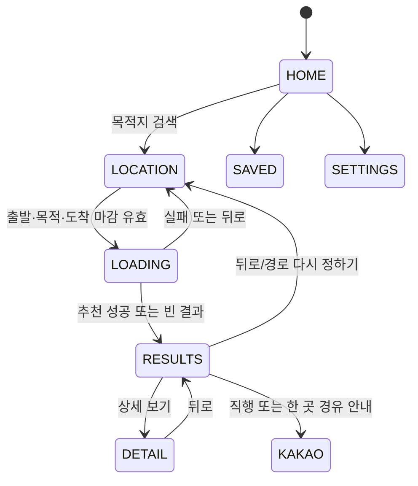

# 화면 흐름과 상태 전이

기준일: `2026-08-28`

이 문서는 Gate 2 활성 화면만 설명한다. 과거 CONDITIONS·복수 경유지 화면은
소스에서 제거됐고 legacy API 계약만 별도로 유지한다.

## 1. 전체 활성 흐름

필수 선택 단계는 LOCATION 한 화면뿐이다. 경유지는 선택 사항이며 RESULTS에서
없음 또는 한 곳으로 제한한다.

## 2. 경로 상태와 복원

`RouteFlowViewModel`이 다음을 소유하고 `SavedStateHandle`에 저장한다.

- 출발지·목적지 이름과 좌표
- 절대 도착 마감 epoch
- 이동수단과 선택 관심 카테고리
- 선택한 장소 ID

추천 목록·경로 path는 네트워크 결과이므로 프로세스 종료 뒤 그대로 복원하지 않는다.
payload 없이 RESULTS/DETAIL만 복원되면 LOCATION으로 안전하게 돌아간다. 로딩 중
뒤로가기는 진행 중 요청을 취소하므로 늦게 도착한 응답이 결과 화면을 다시 열지 않는다.

## 3. HOME

- 상단 `목적지 검색`에서 새 경로 흐름을 시작한다.
- GPS가 있으면 출발지로 전달하고, 없으면 LOCATION에서 위치 권한을 요청한다.
- 홈 Kakao 지도·GPS, 틈새 발견 탭과 설정 탭은 기존 동작을 유지한다.
- 새 검색은 이전 경유 선택과 진행 중 요청을 초기화하고 저장된 출발 알림도 취소한다.

## 4. LOCATION — 한 화면 입력

### 필수 입력

1. 출발지
2. 목적지
3. 도착 마감 시각

도착 마감은 기본 미선택이다. 시간 선택기를 열었다가 취소하면 기존 값이 바뀌지 않고,
확인을 눌렀을 때만 절대 epoch로 저장한다. 현재부터 15분 이상 24시간 이하만 허용하며
자정이 지난 시각은 다음 날로 해석한다.

### 선택 입력

관심 카테고리는 같은 화면의 약한 선택 필터다. 아무 것도 고르지 않아도 진행할 수
있으며 별도 CONDITIONS 화면은 없다.

### 위치·키보드

- 현재 위치 권한을 거부해도 출발지를 직접 검색할 수 있다.
- 위치 서비스 꺼짐과 영구 거부는 각각 시스템 설정으로 안내한다.
- 목적지 검색은 2자 이상, 350ms debounce, 최대 5개 결과다.
- CTA는 세 값과 좌표가 유효할 때만 활성화된다.

## 5. LOADING

Android는 `timeModel=ARRIVAL_DEADLINE_V1`과
`arrivalDeadlineEpochMillis`를 전송한다. 사용자 안전여유 입력이나 legacy
`extraTimeMinutes`를 신규 요청에 섞지 않는다.

- 성공과 빈 추천은 RESULTS로 이동한다.
- 첫 요청 실패는 오류와 함께 LOCATION으로 돌아간다.
- RESULTS의 재확인 실패는 마지막 결과를 유지한다.
- 뒤로가기는 요청을 취소하고 LOCATION으로 이동한다.

## 6. RESULTS — 선택 없음 또는 한 곳

### 지도

- 각 후보 핀은 장소명이나 평균 체류 대신 `+N분` 추가 이동시간을 표시한다.
- 선택된 장소는 강조하고, 같은 장소를 다시 누르면 선택을 해제한다.
- 다른 장소를 누르면 기존 선택을 교체한다.

### 카드

- 장소명, 카테고리, 경로 정보와 운영상태를 표시한다.
- 선택 후 `이동 기준 최대 약 N분`과 `H시 M분까지 출발`을 표시한다.
- 평균 체류시간을 사용자 판단 근거로 표시하지 않는다.
- 상세 보기는 보조 액션이고 핵심 완료는 결과 화면에서 가능하다.

### CTA와 빈 결과

- 미선택: `목적지로 바로 안내`
- 한 곳 선택: `이곳 들러 카카오맵 안내`
- 후보가 없어도 직행 CTA는 남는다.
- 직행 자체가 빠듯한 경우와 최소 15분 체류 후보가 없는 경우를 다른 문구로 안내한다.
- `현재 교통으로 다시 확인`은 사용자가 명시적으로 실행하는 수동 갱신이다.
- 재확인에서 선택 장소가 사라지면 기존 알림을 취소하고, 남아 있으면 새 출발
  마감으로 저장값과 예약을 교체한다.

## 7. 선택형 출발 알림

장소를 선택한 경우에만 `출발 5분 전에 알려드릴까요?` 토글을 표시한다.

1. Android 13+는 토글을 켤 때만 알림 권한을 요청한다.
2. 허용되면 최신 출발 마감 5분 전을 `setAndAllowWhileIdle`로 예약한다.
3. 이미 알림 시각은 지났지만 출발 마감 전이면 즉시 알리고, 출발 마감 뒤면 예약하지 않는다.
4. 재부팅·패키지 교체 시 유효한 여행만 다시 예약한다.
5. 알림 거부·해제와 무관하게 카카오맵 안내는 계속 동작한다.

exact alarm과 백그라운드 위치 권한은 사용하지 않는다. 따라서 절전 정책에 따라 알림이
지연될 수 있으며 실시간 도착 감지로 표현하지 않는다.

## 8. DETAIL

- 추천 장소 이미지·이름·주소·태그·운영상태를 보여준다.
- 결과의 최대 체류·출발 마감 판단을 대체하거나 평균 체류를 다시 표시하지 않는다.
- 저장 하트와 카카오맵 안내를 제공한다.
- 뒤로가기는 RESULTS로 돌아간다.

## 9. 외부 의존성과 실패 처리

| 구간 | 의존성 | 실패 처리 |
|---|---|---|
| 위치 입력 | Android LocationManager, Kakao Local | 직접 검색과 설정 안내 |
| 추천 | Vercel, Supabase, Kakao Mobility | 입력 복귀 또는 마지막 결과 유지 |
| 지도 | Kakao Maps Android SDK | 설정 안내·재시도 |
| 길 안내 | 카카오맵 앱/웹 | 설치 페이지 또는 웹 fallback |
| 알림 | AlarmManager, 알림 권한 | 안내는 유지하고 알림만 비활성 |

교통과 외부 내비가 다시 계산되므로 `도착 보장`, `실시간 추적` 같은 표현은 쓰지 않는다.
