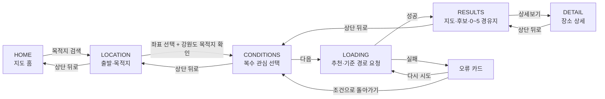
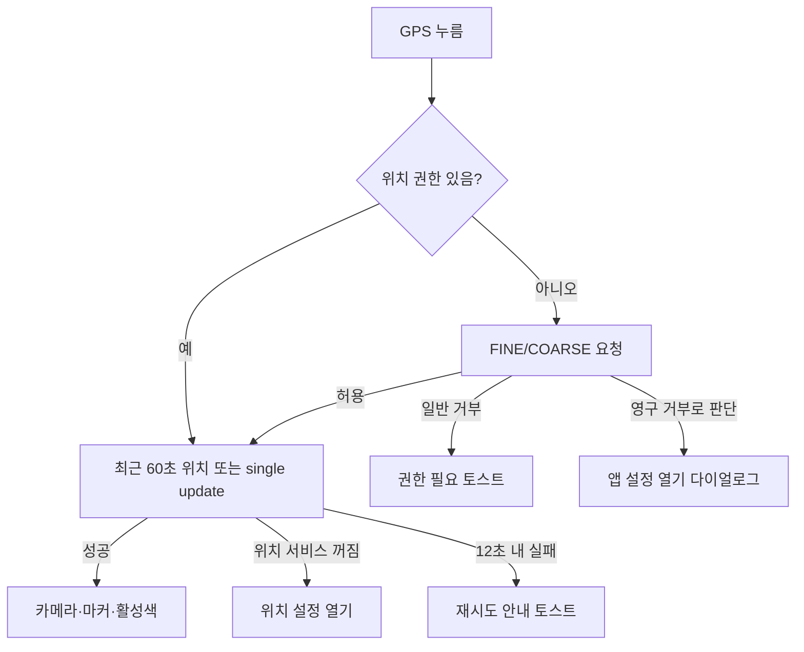
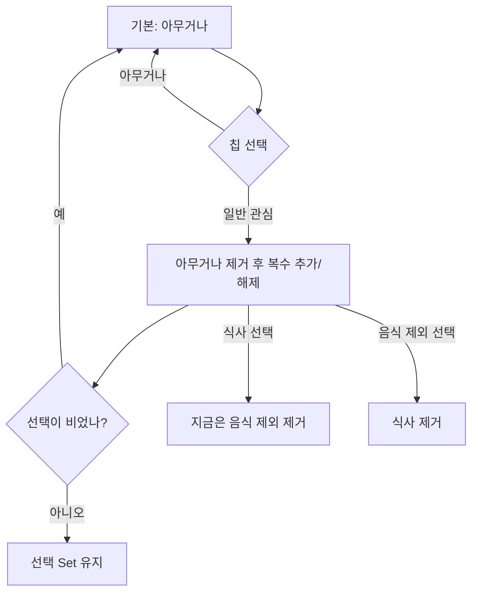
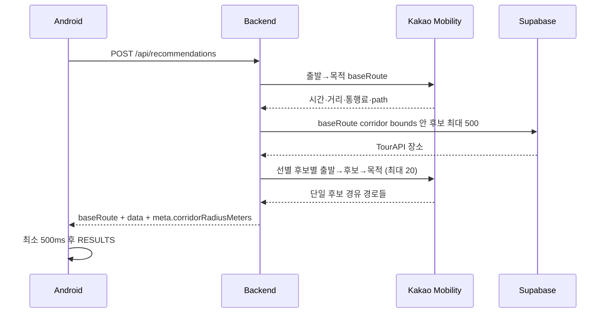
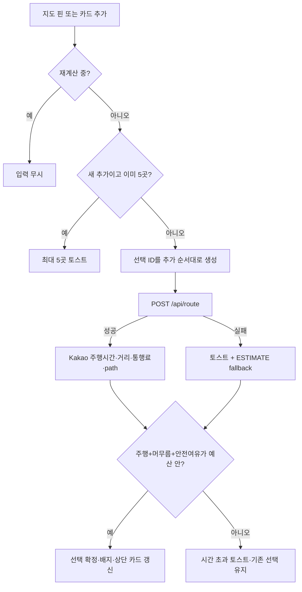

# 화면 흐름과 상태 전이

기준일: `2026-08-20`
기준 코드: `android/app/src/main/java/com/tteumsae/app/ui/TteumsaeApp.kt`

이 문서는 현재 활성 화면의 진입 상태, 사용자 액션, 검증, 오류, 뒤로 동작을 기록한다. 시안에만 있는 화면은 구현된 것으로 간주하지 않는다.

## 1. 전체 활성 흐름



활성 흐름에는 시간 입력 화면이 없다. Android는 추천 API 호환을 위해 내부에서
`extraTimeMinutes=1,440`, `safetyBufferMinutes=15`를 사용한다. 서버는 Kakao
`baseRoute`를 먼저 계산한 뒤
`effectiveDeadlineMinutes = baseRouteMinutes + extraTimeMinutes`로 변환한다.

```text
우회 주행시간 + 기본 머무름 + 안전여유 ≤ extraTimeMinutes
```

`TimeScreen`, `SearchMode.NEARBY`, `ModeSelector`는 소스에 남아 있지만 위
전이에서는 도달할 수 없다. 내부 시간값은 사용자가 입력한 도착 마감이 아니므로
이 흐름을 시간 보장으로 설명하지 않는다.

## 2. 전역 상태와 복원 범위

| 상태 | 저장 방식 | 사용 화면 | 복원 한계 |
|---|---|---|---|
| `screen`, 이름, 내부 호환 시간값, 이동수단 | `rememberSaveable` 일부 | 전체 | 화면 enum은 복원돼도 다음 좌표·추천과 불일치할 수 있음 |
| 출발/목적 좌표 | `remember` | LOCATION 이후 | 프로세스 종료 시 소실 |
| 관심 조건 | `remember`/`rememberSaveable` 혼합 | CONDITIONS 이후 | 복수 intent Set은 프로세스 종료 시 소실 |
| 추천, warning, `baseRoute`, corridor | `remember` | RESULTS/DETAIL | 프로세스 종료 시 소실 |
| 선택 경유 ID/현재 상세 | `remember` | RESULTS/DETAIL | 프로세스 종료 시 소실 |
| 홈 GPS 대상 | 루트 `remember` | HOME | 루트가 살아 있으면 다른 탭을 다녀와도 유지 |
| 저장 장소 | Room `GUEST` + lifecycle-aware Flow | 둘러보기/상세/설정 | 로컬 영속; 계정 동기화 없음 |

앱은 `NavHost` 없이 `AppDestination` 상태와 루트 `BackHandler`로 전환한다. 화면 안의 뒤로 버튼과 시스템 뒤로는 같은 `previousDestination` 정책을 사용하며, 저장 화면의 키보드·상세 닫기는 화면 내부 `BackHandler`가 먼저 처리한다.

## 3. HOME — 지도 홈

### 진입 상태

- 기본 지도 중심: 강릉 `(37.7645, 128.8996)`, zoom 13.
- 첫 실행 또는 오늘 숨김 기록이 없으면 소개 팝업을 표시한다.
- 지도 네이티브 키가 없으면 SDK 대신 플레이스홀더와 키 설정 안내를 표시한다.

### 레이아웃과 고정 위치

1. 전체 화면 Kakao Map.
2. 상태바 아래, 좌우 20dp의 흰 검색 카드: `목적지 검색`.
3. 지도 우하단 20dp/24dp 여백의 원형 GPS 버튼.
4. 하단 92dp 내비게이션: 좌측 `틈새 발견`, 중앙 58dp 돌출 지도 버튼, 우측 `설정`.
5. 내비게이션 상단 모서리 20dp, 브랜드색 10% 그림자. 중앙 지도 버튼은 홈에서 빨강/흰 아이콘/그림자, 다른 탭에서 연회색/회색 아이콘·테두리/그림자 없음이다.

### 액션과 상태

| 액션 | 상태 전이·효과 |
|---|---|
| 검색 카드 | `ON_THE_WAY`, `CAR`로 탐색을 시작하고 이전 경유 선택을 비운 뒤 LOCATION |
| GPS 비활성→누름 | 권한 확인 후 위치 획득; 지도 카메라와 마커 이동 |
| GPS 활성→누름 | 현재 위치 마커/활성 상태 제거 |
| 좌측 탭 | 카탈로그/저장 화면 |
| 중앙 지도 | HOME |
| 우측 탭 | 설정 |
| 소개 `오늘 하루 보지 않기`+확인 | 기기 날짜를 저장하고 당일 숨김 |

### GPS 예외



## 4. LOCATION — 출발·목적지

### 진입 상태

- 홈 GPS 좌표가 있으면 `startLocation.id=current-location`으로 전달한다.
- 좌표가 없고 이름이 `현재 위치`면 진입 효과가 자동으로 GPS 요청을 시작한다.
- 목적지는 비어 있고 250ms 뒤 자동 포커스한다.
- 이 화면은 전체 흰 화면+`LazyColumn`이며 바텀시트가 아니다.

### 화면과 키보드

1. 상태바 아래 48dp 뒤로 버튼.
2. 제목 `지금 어디로 가는 길인가요?`와 설명.
3. 회색 컨테이너 안 출발지/목적지 두 행.
4. 출발지 우측 최소 48dp `현위치` 토글.
5. `Scaffold.bottomBar`의 56dp `다음`; `imePadding`과 navigation bar padding 적용.

키보드가 열려도 CTA는 IME 위로 이동한다. 본문과 검색 결과는 `LazyColumn` 안에서 스크롤된다. `다음` 클릭 시 포커스를 지우고 키보드를 숨긴다.

### 검색 필드 상태

| 상태 | UI·행동 |
|---|---|
| 선택 안 됨·0~1자 | API 호출 없음 |
| 2자 이상 | 350ms 디바운스 후 `/api/geocode`; 로딩 표시 |
| 목적지 검색 | Android가 검색어에 `강원 `을 덧붙일 수 있음 |
| 결과 있음 | 최대 5개 이름·주소; 선택하면 이름·좌표 저장 |
| 결과 없음 | 더 자세한 장소명을 요구하는 문구 |
| 요청 실패 | 작업명+오류, `다시 시도` |
| 선택 완료 | 한 줄 말줄임; 텍스트 누르면 지우고 입력 포커스 |
| 현위치 활성 | 빨간 배경/흰 글자. 다시 누르면 출발지를 비우고 비활성 |
| 현위치 비활성 | 연한 브랜드 배경/진한 브랜드 글자 |

현위치 획득 후 `/api/region` 역지오코딩에 성공하면 `현재 위치` 대신 행정 주소를 표시한다. 실패는 조용히 무시하고 기존 이름을 유지한다.

### 검증과 전이

`다음` 활성 조건:

- `startLocation != null`
- `endLocation != null`
- 위치 최종 확인 중이 아님
- GPS 획득 중이 아님

클릭 후 목적지를 `/api/region`으로 확인한다. 강원도 밖이면 `목적지가 강원도 밖이라 이동 중 들를 장소를 추천할 수 없어요.` 토스트 후 그대로 남는다. 성공하면 이름/좌표를 확정하고 CONDITIONS로 이동한다.

### 뒤로

- 상단 뒤로: HOME.
- 시스템 뒤로: 앱 내부 계약 없음.

## 5. 비활성 레거시 — `TimeScreen`

15분~6시간 슬라이더와 최대 1,440분 직접 입력 UI 소스는 남아 있지만
`AppScreen`에 `TIME` 값이 없고 어떤 활성 전이에서도 호출하지 않는다. 신규
작업자는 이 화면을 구현 완료 기능으로 보거나 QA 대상 활성 화면으로 다루지
않는다. 시간 입력을 다시 제공하려면 제품 문구, 추천 계약과 결과 예산 검증을
함께 재설계해야 한다.

## 6. CONDITIONS — 복수 관심 선택

### 진입·레이아웃

- 키보드를 즉시 숨긴다.
- 흰 전체 화면, 상단 뒤로, 제목 `좀 더 끌리는 장소가 있나요?`, 설명, `FlowRow` 관심 칩.
- 하단 56dp `다음`을 `Scaffold.bottomBar`에 고정한다.
- 칩 간격: 가로 10dp, 세로 12dp; 선택 칩은 연한 브랜드 배경+브랜드 테두리/글자.

### 선택 규칙



| UI 관심 | 서버 카테고리 |
|---|---|
| 아무거나 | 빈 배열 |
| 식사 | `RESTAURANT` |
| 카페 | `CAFE` |
| 산책·관광 | `ATTRACTION`, `LEISURE` |
| 실내 활동 | `CULTURE`, `SHOPPING` |
| 지금은 음식 제외 | 전체 카테고리에서 `RESTAURANT` 제외 |

복수 선택은 합집합으로 전송한다. `아무거나`가 기본이라 `다음`은 항상 활성이다.

### 전이

- 뒤로: LOCATION.
- 다음: LOADING.

## 7. LOADING — 추천과 기준 경로

### 요청 순서



Android 요청값은 `ON_THE_WAY`, `CAR`, 내부 고정 `extraTimeMinutes=1,440`,
`safetyBufferMinutes=15`와 선택 카테고리다. 서버는 baseRoute를 계산하고
`effectiveDeadlineMinutes=baseRouteMinutes+extraTimeMinutes`를 적용하며,
baseRoute path 주변 800m~8km corridor에서 후보를 찾는다.

### 화면 상태

| 상태 | UI |
|---|---|
| 진행 | 지도 배경, 검색 아이콘, 체크리스트 |
| 성공 | 추천, warning, baseRoute, corridor 반경 저장 후 RESULTS |
| 실패 | `장소를 추천하지 못했어요`, 원인, `다시 시도`, `조건으로 돌아가기` |

진행 문구는 `가는 길 주변에서 들를 장소`와 기본 경로·경유 경로·머무름·도착 전
여유 계산 단계를 표시한다. 사용자 시간 입력이 있는 것처럼 표현하지 않는다.

## 8. RESULTS — 경로 주변 후보와 0~5 경유지

### 진입 상태

- `currentRoute = baseRoute`. baseRoute 누락 시 추천 한 건을 이용한 `ESTIMATE` 직행 fallback.
- 선택 경유 ID는 빈 리스트.
- corridor 반경은 추천 응답의 `meta.corridorRadiusMeters`, 기본값 1600m.

### 레이아웃·고정 위치

1. 전체 Kakao Map.
2. 상태바 아래 좌우 20dp: 흰 `RouteSummaryCard`.
3. 지도 우하단: 현재 위치 버튼. 후보가 있으면 카드 캐러셀 위쪽으로 350dp, 빈 결과면 170dp 띄운다.
4. 화면 하단: 후보 카드 `LazyRow` 또는 빈 결과 카드.
5. navigation bar 위 고정 56dp CTA `이 경로로 카카오맵으로 안내받기`.

상단 카드는 뒤로, `총 소요시간`, 거리, 통행료, `경유지 N/5 추가됨`, 정보 아이콘을 표시한다. 총 소요시간은 `currentRoute.totalDrivingMinutes + 선택 장소 stayMinutes 합계`다.

### 지도 의미

- 초기 붉은 선: `baseRoute.path`.
- 출발/목적 라벨: 출발은 연한 빨강, 목적은 브랜드 빨강.
- 후보: 좌표가 있는 추천만 파랑 카테고리 핀.
- 선택 후보: 빨간 핀과 추가 순서 배지.
- 붉은 반투명 영역: route path를 약 10구간으로 샘플링한 원형 polygon 중첩.

서버 후보는 **baseRoute path까지의 거리**로 뽑는다. 그러나 Android는 경유 선택 후 polygon 중심선도 선택된 `currentRoute.path`로 바꾼다. corridor를 “최초 후보 범위”로 설명하려면 Android에서 중심선을 baseRoute에 고정해야 한다.

### 후보 카드

- 화면폭-40dp 카드 한 장씩 가로 스크롤.
- 대표 이미지 142dp 높이, 좌상단 `position/total`, 우상단 `추가하기` 또는 `추가됨`.
- 장소명 한 줄 말줄임, `상세보기`, 첫 구간 거리/약 시간/카테고리.
- `평균 머무름`, 태그 앞 4개.
- 이미지 실패/없음은 기본 이미지.

### 선택과 실제 재계산



- 경유 순서는 자동 최적화가 아니라 사용자가 추가한 순서다.
- `/api/route`는 0~5개를 허용한다. 0개는 직행, 1~5개는
  출발→각 waypoint→최종 목적지를 Kakao Mobility로 계산한다.
- 재계산 중 상단 시간은 progress가 되고 추가 토글은 무시된다.
- 선택 경로의 주행시간, 선택 장소 머무름 합과 내부 15분 안전여유가
  `baseRoute 주행시간 + 내부 1,440분`을 넘으면 새 추가를 거부한다. 제거는
  항상 허용한다. 이 상한은 사용자가 설정한 도착 마감이 아니다.
- 실패 fallback은 기준 직행시간+각 단일 추천의 우회시간을 합친다. 거리/통행료 정확도도 떨어질 수 있으나 UI에는 지속적인 `예상` 배지가 없다.
- 카드에 표시하는 총 소요는 주행시간에 각 장소의 기본 머무름을 더한 값이며, Kakao API 자체는 머무름을 모른다.

### 정보 다이얼로그와 CTA

- `경유지 N/5`/정보 아이콘: 최대 5곳, 추가/제거 시 실시간 경로 재계산 설명.
- 하단 CTA는 선택 0곳에서도 활성: 직행 카카오맵 URL. 단, 재계산 중이거나
  현재 합산 경로가 내부 호환 예산을 넘으면 비활성이다.
- 선택 1~5곳: 같은 추가 순서로 경유지와 최종 목적지를 카카오맵 car URL에 넣는다.

### 결과 없음

- 제목 `경로 주변에서 장소를 찾지 못했어요`.
- warning이 있으면 warning, 없으면 관심 조건 완화 안내.
- `관심 조건 해제하기`: intent를 `아무거나`로 초기화하고 즉시 다시 로딩.
- `다른 목적지 검색하기`: LOCATION.

### 뒤로

- 상단 카드 뒤로: CONDITIONS.
- 상세에서 돌아오기: 선택 ID와 현재 route를 유지한 RESULTS.
- 시스템 뒤로: 앱 내부 계약 없음.

## 9. DETAIL — 새 장소 상세

### 진입·레이아웃

1. 고정 top bar: 뒤로, `장소 상세`, 저장 하트.
2. 스크롤 본문: 1.58:1 대표 이미지, 카테고리/장소명.
3. 두 핵심 지표: 평균 머무름; 출발→장소와 목적지까지 추가시간.
4. 회색 방문 정보 카드: 운영시간, 휴무일, 이용요금, 주차, 활동, 반려동물.
5. 장소 소개와 한 줄 주소 링크.
6. 고정 bottom bar: 내부 고정 15분 안전여유 안내, 56dp 카카오맵 CTA.

본문은 `LazyColumn`이며 top/bottom bar padding을 적용한다. 긴 장소명은 여러 줄 가능하고 방문 정보 값은 최대 2줄, 주소는 한 줄 말줄임이다.

### 데이터와 fallback

| 항목 | 값 없음/판정 방식 |
|---|---|
| 대표 이미지 | 브랜드 기본 이미지 |
| 운영시간·휴무 | `정보 확인 필요` |
| 이용요금 | 항상 `정보 확인 필요` |
| 주차 | `주차 가능` 태그가 있으면 가능, 아니면 확인 필요 |
| 활동 | 관광지/레포츠면 야외, 아니면 `실내·외 확인 필요` |
| 반려동물 | 해당 태그가 있으면 가능, 아니면 확인 필요 |
| 소개 | recommendation reason 또는 기본 소개 |
| 주소 | `주소 정보 확인 필요` |

### 액션과 한계

- 하트: 현재 장소를 Room `GUEST` 범위에 로컬 저장/해제하고 Flow로 다른 화면에도 반영.
- 주소 행: 카카오맵 장소명 검색.
- 하단 CTA: 현재 상세 장소를 중복 없이 포함한 경로를 `/api/route`로 다시
  계산하고 같은 시간 예산을 통과한 경우에만 최대 5곳과 최종 목적지를 연다.
  이미 5곳을 선택했다면 마지막 선택을 현재 상세 장소로 바꾼다고 안내한다.
- 이동시간 지표는 고정된 `현재 위치`가 아니라 실제 `criteria.startName`을 쓴다.
- 하단 안내의 15분은 내부 고정값이며 사용자가 선택한 값이나 실제 도착 보장이
  아니다.
- 상단 뒤로: RESULTS.

## 10. 틈새 발견·저장

### 진입·지역과 페이지

1. 최초 선택 지역은 `강릉`이며 `/api/places?page=1&pageSize=100&sigunguCode=1`을 요청한다.
2. 지역 제목과 아래 화살표를 누르면 `강원도 전체`와 강원 18개 시군 DropdownMenu가 열린다.
3. 지역을 바꾸면 기존 페이지 상태를 첫 페이지로 교체하고 해당 `sigunguCode`로 다시 요청한다. `강원도 전체`는 파라미터를 생략한다.
4. 끝 6개 전 같은 지역의 다음 페이지를 자동 요청하고 `content_id` 중복을 제거한다.

지역 코드:

```text
1 강릉, 2 고성, 3 동해, 4 삼척, 5 속초, 6 양구, 7 양양, 8 영월,
9 원주, 10 인제, 11 정선, 12 철원, 13 춘천, 14 태백, 15 평창,
16 홍천, 17 화천, 18 횡성
```

서버에서 받은 카탈로그는 코드 기준이다. Room에 저장된 다른 지역 장소도 목록 후보에 합치며, Android `PlaceCandidate`에 `sigungu_code`가 없으므로 이 로컬 사본은 주소가 선택 지역명을 포함하는지로 보완 필터한다. `강원도 전체`에서는 모든 로컬 찜을 포함한다.

| 상태 | UI |
|---|---|
| 첫 로딩 | 중앙 progress |
| 첫 실패 | 오류와 `다시 불러오기` |
| 추가 실패 | 토스트; 기존 목록 유지 |
| 장소 없음 | 등록 장소 없음 |
| 필터 결과 없음 | 조건에 맞는 장소 없음 |
| 정상 | 검색·지역·필터·`스팟 (N)`·정렬·2열 카드와 추가 로드 |

### 검색·필터·정렬

- 검색 placeholder는 `틈새 위치 검색`; 선택 지역에서 현재 받은 카탈로그와 해당 지역 로컬 찜의 이름·주소를 검색한다.
- 필터 칩은 `전체`, 하트 아이콘이 있는 `찜`, 7개 카테고리다. 카테고리와 찜을 동시에 적용할 수 있고 `전체`는 두 상태를 해제한다.
- `스팟 (N)`은 서버 전체가 아니라 지역+검색+찜+카테고리를 통과한 현재 로컬 목록 수다. 정보 tooltip은 아래로 스크롤하면 더 불러온다고 설명한다.
- 정렬은 `저장 우선순`과 `이름순` 토글이며 인기순 데이터/정렬은 아니다.
- 카드 이미지는 직접 다운로드하고 메모리 캐시하며 실패 시 기본 이미지를 표시한다.
- 2열 카드는 장소명 한 줄 말줄임, 카테고리, `평균 머무름`, 축약 태그와 찜 하트를 표시한다. 저장 해제는 Snackbar로 되돌릴 수 있다.

## 11. 설정

| 행 | 액션·상태 |
|---|---|
| 위치 권한 | Android 앱 상세 설정 열기; 복귀 시 상태 갱신 |
| 카카오맵 | 설치 시 실행, 미설치 시 Play Store/웹 |
| 캐시 지우기 | 확인 후 이미지 LRU와 `cacheDir` 삭제 |
| 저장 장소 비우기 | `이 기기에 N개 저장됨` 표시 후 확인하면 Room의 `GUEST` 저장을 모두 해제 |
| 개인정보처리방침 | URL 빈 값, 준비 중 |
| 위치기반서비스 약관 | URL 빈 값, 준비 중 |
| 문의하기 | `minjaeimnyda@gmail.com` mailto |
| 앱 버전/출처 | 읽기 전용 |

## 12. 명시적 뒤로가기 계약

| 현재 화면 | 화면 내 뒤로 액션 | 이동 대상 |
|---|---|---|
| HOME | 없음 | 없음 |
| LOCATION | 상단 화살표 | HOME |
| CONDITIONS | 상단 화살표 | LOCATION |
| LOADING 진행 | 없음 | 없음 |
| LOADING 오류 | 조건으로 돌아가기 | CONDITIONS |
| RESULTS | 상단 카드 화살표 | CONDITIONS |
| DETAIL | 상단 화살표 | RESULTS |
| 카탈로그 상세 | 상단 화살표 | 카탈로그 |
| 카탈로그·설정 | 하단 내비게이션 | 선택 루트 |

## 13. 화면별 외부 의존성과 실패 처리

| 화면 | 의존성 | 실패 처리 |
|---|---|---|
| HOME | Kakao Map SDK, Android 위치 권한/서비스 | 지도 재시도, 위치/앱 설정 다이얼로그, 토스트 |
| LOCATION | GPS, `/api/geocode`, `/api/region` | 필드 재시도, 강원도 밖/위치 오류 토스트 |
| CONDITIONS | 로컬 상태 | 별도 오류 없음 |
| LOADING | `/api/recommendations`, Kakao Mobility, Supabase | 전체 오류 카드·재시도 |
| RESULTS | Kakao Map SDK, `/api/route`, Kakao 외부 URL | 지도 재시도, route 실패 시 estimate+토스트, 최대 5곳 토스트 |
| DETAIL | 이미지 URL, Kakao 외부 앱/웹, Room | 이미지 fallback, 좌표/외부 앱 실패 토스트 |
| 둘러보기 | `/api/places`, 이미지 URL | 첫 로드 재시도, 추가 로드 토스트, 이미지 fallback |
| 설정 | Android Settings, package manager, mail/browser | 기능별 토스트; 정책은 준비 중 |
