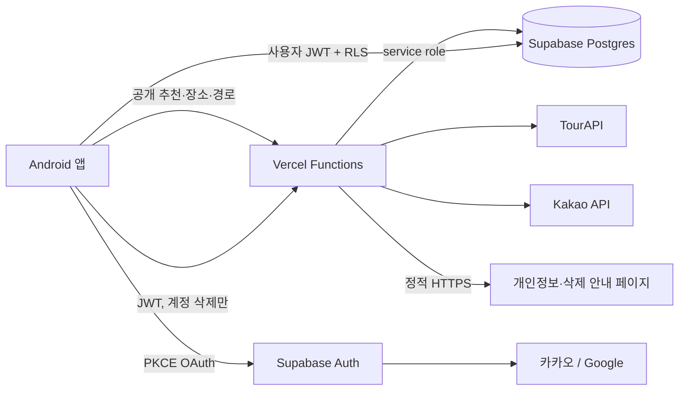

# 틈새 선택형 계정·저장 장소 동기화 설계

작성일: 2026-08-26  
대상: Android 선택형 로그인, Supabase Auth/RLS, 저장 장소 동기화, 계정 삭제,
`TteumsaeApp.kt` 점진적 분리  
상태: 구현 전 승인 설계

## 1. 배경

현재 틈새는 로그인 없이 장소 추천, 경로 계산, 저장 장소, 외부 카카오맵 실행을
사용할 수 있다. 서버는 Vercel Functions에서 TourAPI와 Kakao API를 호출하고,
Supabase는 TourAPI 장소 카탈로그와 동기화 커서 저장에만 사용한다.

Android의 저장 장소는 `SharedPreferences`에 장소 카드 전체를 JSON으로 저장한다.
계정, 인증, 사용자별 서버 데이터, 기기 간 동기화는 없다. 설정 화면은 위치 권한,
카카오맵 설치 상태, 캐시·저장 장소 삭제, 정책·문의 링크를 제공하지만 사용자 계정
영역은 없다.

`android/app/src/main/java/com/tteumsae/app/ui/TteumsaeApp.kt`는 현재 약 5,091줄이며
다음 책임이 한 파일에 집중되어 있다.

- 앱 화면 전환과 뒤로가기
- 추천 흐름의 입력·결과 상태
- 장소 카탈로그와 저장 목록 상태
- `SharedPreferences` 직렬화
- 홈, 저장, 설정, 위치, 조건, 결과, 상세, 지도 화면
- 네트워크 호출과 코루틴 실행
- 카카오맵 SDK 렌더링과 마커 비트맵 생성
- 카카오맵 외부 실행, 앱 설정, 정책·문의 인텐트
- 경로 선택과 추천 필터 순수 계산

계정 기능을 같은 파일에 추가하면 변경 위험과 테스트 비용이 더 커진다. 그러나 계정
기능을 이유로 전체 화면 전환이나 지도 계층을 한 번에 재작성하는 것도 현재 단계에는
위험하다. 따라서 이번 설계는 선택형 계정 기능과 저장 장소 동기화를 추가하면서,
직접 수정하는 영역과 안전한 순수 로직부터 점진적으로 분리한다.

## 2. 목표

1. 로그인 없이 기존 핵심 기능을 모두 유지한다.
2. 카카오 또는 Google로 로그인하면 프로필과 저장 장소를 기기 간 동기화한다.
3. 게스트가 이미 저장한 장소를 최초 로그인 때 계정에 자연스럽게 합친다.
4. 저장과 저장 해제는 네트워크 상태와 무관하게 즉시 화면에 반영한다.
5. 다른 기기와 오프라인 변경이 있어도 저장 해제한 장소가 임의로 되살아나지 않게 한다.
6. 사용자 위치, 검색 기록, 활성 경로, 알림 상태는 서버에 저장하지 않는다.
7. 사용자가 앱 안에서 계정과 관련 데이터를 즉시 삭제할 수 있게 한다.
8. 앱을 삭제한 사용자도 공개 웹 경로에서 계정 삭제를 요청할 수 있게 한다.
9. `TteumsaeApp.kt`를 대규모 재작성 없이 책임별로 점진 분리한다.
10. 인증 또는 동기화 장애가 기존 게스트 추천·경로 기능을 막지 않게 한다.

## 3. 비목표

- 로그인을 앱 사용의 전제 조건으로 만들지 않는다.
- 이메일·비밀번호 로그인을 추가하지 않는다.
- Apple, 네이버 등 세 번째 로그인 제공자를 추가하지 않는다.
- 계정 간 수동 연결 UI는 첫 버전에 제공하지 않는다.
- 사용자 설정을 서버에 동기화하지 않는다.
- 연령대·성별을 첫 버전 추천 점수나 필터에 사용하지 않는다.
- 사용자 위치, 목적지, 검색어, 실제 이동 경로, 추천 열람 기록을 서버에 저장하지 않는다.
- 활성 경로, 도착 마감, 도착 감지 상태, 예약 알림을 서버에 저장하지 않는다.
- Supabase Realtime로 저장 목록을 상시 구독하지 않는다.
- Vercel에 프로필·저장 장소 CRUD API를 별도로 만들지 않는다.
- 전체 앱을 Navigation Compose나 단일 아키텍처로 한 번에 전환하지 않는다.
- Kakao Map SDK 생명주기와 지도 렌더링을 이번 작업에서 전면 재작성하지 않는다.
- 정책 문서의 법률 적합성을 개발 명세만으로 확정하지 않는다. 출시 전 별도 검토가 필요하다.

## 4. 확정된 제품 원칙

### 4.1 게스트 우선

- 앱 첫 실행은 게스트 상태다.
- 홈, 위치 선택, 조건 선택, 추천, 상세, 저장, 카카오맵 길 안내는 로그인 없이 동작한다.
- 로그인 CTA는 설정 화면의 보조 기능으로 제공한다.
- 로그인 화면은 `저장 장소를 다른 기기에서도 볼 수 있어요`라는 구체적 이점을 설명한다.
- 로그인 실패, 취소, 공급자 장애는 게스트 사용을 방해하지 않는다.

### 4.2 계정 데이터 범위

서버에 저장하는 사용자 데이터는 다음뿐이다.

- Supabase Auth가 관리하는 계정·인증 식별 정보
- 프로필: 닉네임, 프로필 이미지 URL, 선택형 연령대, 선택형 성별
- 저장 장소 상태

저장 장소의 이름·주소·이미지 같은 공개 장소 정보는 사용자 데이터 행에 복제하지 않고 기존
`public.places`와 Vercel 장소 API를 사용한다. 추천 당시의 출발지별 이동시간·우회시간은
저장 장소의 고유 속성이 아니므로 계정 동기화 대상에 포함하지 않는다.

다음 데이터는 기기 로컬에만 둔다.

- 위치·알림·백그라운드 위치 권한 상태
- 홈 안내 `오늘 하루 보지 않기`
- 출발 알림 사용 여부와 OS 알림 상태
- 현재 활성 경로와 경유지
- 도착 마감과 체류 가능 시간 계산 결과
- 지오펜스·도착 감지 상태
- 최근 좌표, 검색어, 추천 기록, 실제 이동 기록
- 캐시와 기기별 일시 상태

향후 `기본 이동수단`, `선호 카테고리`처럼 실제 계정 단위 설정이 생기면 별도 DB
마이그레이션으로 추가한다. 사용처가 없는 범용 JSON 설정 테이블은 지금 만들지 않는다.

### 4.3 선택형 인구통계 프로필

- 연령대와 성별은 온보딩이나 로그인 완료의 필수 입력이 아니다.
- 프로필 편집 화면에서만 선택적으로 입력한다.
- 각 항목은 미입력과 `응답하지 않음`을 허용한다.
- 첫 버전 추천 엔진은 이 값을 읽거나 전송하지 않는다.
- 향후 충분한 데이터와 검증 근거가 생겨도 강제 제외 필터가 아니라 약한 개인화 신호로만
  검토한다.

## 5. 전체 시스템 구조



역할 분리는 다음과 같다.

| 구성요소 | 책임 |
|---|---|
| Android | 게스트·계정 UI, OAuth 시작·콜백, Room 로컬 원본, 동기화, 로컬 데이터 정리 |
| Supabase Auth | 카카오·Google 인증, 세션 발급·갱신, 사용자 식별 |
| Supabase Postgres | 기존 장소 카탈로그, 프로필, 저장 상태, RLS |
| Vercel | 기존 공개 API·Cron, 사용자 토큰 검증 후 Auth 계정 관리자 삭제, 정적 정책 페이지 |
| 카카오·Google | OAuth 신원 제공자 |

Android에는 Supabase 프로젝트 URL과 publishable key만 들어간다. `service_role`은 Vercel
환경변수에만 존재한다.

## 6. 인증과 세션

### 6.1 제공자

- 카카오
- Google

이메일·비밀번호 로그인은 제공하지 않는다. 카카오 계정이 이메일 제공에 동의하지 않을 수
있으므로 앱은 이메일을 필수 프로필 값이나 화면 식별자로 가정하지 않는다.

### 6.2 Android OAuth

- Supabase Kotlin SDK의 Auth 모듈을 사용한다.
- 모바일 공개 클라이언트에 맞춰 PKCE 흐름을 사용한다.
- 콜백 딥링크는 `tteumsae://auth-callback`을 기본값으로 한다.
- `AndroidManifest.xml`의 `MainActivity`에 콜백 인텐트 필터를 추가한다.
- `MainActivity.onCreate`와 새 인텐트 수신 지점에서 Supabase 딥링크 처리를 호출한다.
- 로그인 취소와 오류는 설정 화면으로 복귀시키며 게스트 데이터를 유지한다.
- 세션 저장·갱신은 SDK 저장소를 사용하고 앱이 access/refresh token을 별도 JSON에 복제하지
  않는다.

PKCE가 코드 탈취 위험을 줄이지만 커스텀 스킴 자체가 앱 링크처럼 도메인 소유권을 검증하는
방식은 아니다. 향후 고정 도메인을 보유하면 Android App Links 기반 HTTPS 콜백을 별도
강화안으로 검토할 수 있다.

### 6.3 세션 상태

Android가 화면에 노출하는 계정 상태는 다음으로 제한한다.

- `Guest`
- `RestoringSession`
- `SignedIn(userId, provider, profile)`
- `NeedsReauthentication`
- `AuthUnavailable(message)`

앱 시작 시 세션 복원을 기다리는 동안 기존 게스트 홈은 사용할 수 있다. 계정 영역과 동기화
상태만 로딩으로 표시한다. 인증 복원 실패가 앱 전체 스플래시를 막지 않는다.

### 6.4 프로필 생성

DB 트리거가 Auth 가입 자체를 막는 위험을 피하기 위해 첫 버전에는 `auth.users` 생성
트리거로 프로필을 자동 생성하지 않는다.

로그인 성공 후 앱이 다음 순서로 처리한다.

1. RLS를 통해 자신의 `profiles` 행을 조회한다.
2. 행이 없으면 OAuth 메타데이터에서 닉네임·프로필 이미지 URL을 추출해 upsert한다.
3. 공급자가 값을 주지 않으면 nullable 상태로 둔다.
4. 연령대·성별은 자동 추론하지 않는다.

프로필 생성 실패는 인증 세션을 취소하지 않는다. 계정 화면에서 재시도할 수 있고 저장 장소
동기화는 프로필 행 없이도 사용자 ID를 기준으로 동작한다.

### 6.5 다중 제공자와 계정 연결

첫 버전에는 카카오 계정과 Google 계정을 사용자가 수동 연결하는 UI를 제공하지 않는다.
Supabase Auth가 동일 사용자로 확인하지 못한 두 로그인은 별도 계정으로 취급한다. 특히
카카오는 이메일이 없을 수 있으므로 닉네임 일치만으로 계정을 합치지 않는다. 설정 화면에는
현재 연결된 제공자를 명확히 표시한다.

## 7. Supabase 데이터 모델

새 마이그레이션 파일은 `backend/migrations/003_user_accounts.sql`로 둔다.

### 7.1 `public.profiles`

| 열 | 형식 | 규칙 |
|---|---|---|
| `user_id` | `uuid` | PK, `auth.users(id) on delete cascade` |
| `display_name` | `text` | nullable, 공백 제거 후 1~40자 |
| `avatar_url` | `text` | nullable, 최대 길이 제한 |
| `age_group` | `text` | nullable, 허용값 check |
| `gender` | `text` | nullable, 허용값 check |
| `created_at` | `timestamptz` | 서버 기본값 `now()` |
| `updated_at` | `timestamptz` | 서버가 갱신 |

`age_group` 허용값:

- `UNDER_20`
- `TWENTIES`
- `THIRTIES`
- `FORTIES`
- `FIFTIES`
- `SIXTY_PLUS`
- `PREFER_NOT_TO_SAY`

`gender` 허용값:

- `FEMALE`
- `MALE`
- `OTHER`
- `PREFER_NOT_TO_SAY`

`null`은 아직 선택하지 않은 상태, `PREFER_NOT_TO_SAY`는 사용자가 명시적으로 응답하지
않음을 선택한 상태다. 추천 로직에는 두 상태 모두 전달하지 않는다.

이메일은 `auth.users`와 중복 저장하지 않는다. OAuth 제공자 토큰도 저장하지 않는다.

### 7.2 `public.user_saved_places`

| 열 | 형식 | 규칙 |
|---|---|---|
| `user_id` | `uuid` | `auth.users(id) on delete cascade` |
| `place_id` | `text` | `places(content_id) on delete cascade` |
| `is_saved` | `boolean` | 현재 저장 상태 |
| `saved_at` | `timestamptz` | 마지막으로 저장 상태가 된 시각, nullable |
| `updated_at` | `timestamptz` | 서버 수신 기준 최종 변경 시각 |
| PK | 복합키 | `(user_id, place_id)` |

추천 결과와 카탈로그가 현재 `public.places`에서 생성되는 것을 전제로 외래키를 둔다. 위치
검색 결과처럼 저장 기능을 제공하지 않는 Kakao Local 객체에는 이 테이블을 사용하지 않는다.
향후 외부 장소 저장 기능을 추가하면 `source + external_id` 식별 모델을 별도 설계한다.

저장 해제 시 행을 물리 삭제하지 않고 `is_saved=false`로 upsert한다. 이 tombstone은
오프라인이었던 다른 기기가 오래된 저장 상태를 다시 올리는 문제를 막는다. 첫 버전에는
tombstone 자동 삭제 기간을 두지 않는다. 계정 삭제 시에는 연쇄 삭제된다.

장소가 `is_active=false`가 되어도 `places` 행이 유지되는 현재 동기화 방식에서는 저장 행이
유지된다. 장소가 더 이상 API에서 조회되지 않으면 Android는 마지막 로컬 카드 사본을
`현재 정보를 불러올 수 없음` 상태로 보여주고 경로 추가 행동을 비활성화한다.

### 7.3 서버 시각과 변경 트리거

두 테이블의 `updated_at`은 `before insert or update` 트리거가 항상 `now()`로 덮어쓴다.
클라이언트 기기 시각을 충돌 판정의 권위로 사용하지 않는다. `created_at`도 서버 기본값을
사용한다.

### 7.4 권한과 RLS

두 테이블 모두 RLS를 활성화하고 `anon` 권한을 부여하지 않는다.

`profiles`:

- `authenticated`는 자신의 행만 select 가능
- insert는 `auth.uid() = user_id`인 자신의 행만 가능
- update는 자신의 행만 가능
- 사용자 직접 delete는 허용하지 않음
- insert/update 가능한 열을 프로필 편집 열로 제한

`user_saved_places`:

- `authenticated`는 자신의 행만 select 가능
- insert는 `auth.uid() = user_id`인 행만 가능
- update는 자신의 행의 `is_saved`, `saved_at`만 가능
- 사용자 직접 delete는 허용하지 않음
- 물리 삭제는 Auth 계정 연쇄 삭제 또는 관리자 작업만 수행

정책 식은 인증 여부를 명시해 다음 형태를 사용한다.

```sql
auth.uid() is not null and auth.uid() = user_id
```

`for all` 한 개보다 select, insert, update 정책을 분리해 의도를 명확히 한다. 테이블 단위
전체 update 권한을 무심코 부여하지 않고 열 단위 grant도 함께 제한한다.

## 8. Android 로컬 데이터 모델

### 8.1 저장 기술

- 구조화된 저장 장소와 동기화 상태: Room
- Supabase 세션: Supabase SDK의 세션 저장소
- 홈 안내 날짜, 권한 설명 확인 등 단순 기기 상태: SharedPreferences
- 활성 경로와 알림: 도착 마감 설계의 로컬 저장소

저장 장소는 계정별 상태, tombstone, 동기화 대기 여부가 필요하므로 기존 단일 JSON 목록에서
Room으로 이전한다.

### 8.2 Room 엔티티

`SavedPlaceEntity`의 논리 필드는 다음과 같다.

| 필드 | 설명 |
|---|---|
| `owner_scope` | `GUEST` 또는 `USER:<uuid>` |
| `place_id` | 장소 ID |
| `place_snapshot_json` | 오프라인 카드 표시용 장소 사본 |
| `desired_saved` | 로컬에서 사용자가 원하는 현재 상태 |
| `saved_at_millis` | 저장 정렬용 로컬 시각 |
| `local_revision` | 한 기기 내 변경 순서 |
| `remote_updated_at` | 마지막으로 관찰한 서버 시각, nullable |
| `sync_state` | `SYNCED`, `DIRTY`, `FAILED_AUTH` |
| PK | `(owner_scope, place_id)` |

기기 간 충돌에는 `saved_at_millis`나 기기 시각을 사용하지 않는다. `local_revision`은 같은
기기에서 대기 중인 변경 순서만 보장한다.

별도 대기열 테이블 대신 각 장소 행의 최종 의도와 `DIRTY` 상태를 저장한다. 한 장소를
오프라인에서 여러 번 토글해도 서버에는 최종 상태만 보내면 되기 때문이다.

### 8.3 기존 SharedPreferences 이전

1. Room DB 최초 생성 후 이전 완료 마커를 확인한다.
2. 기존 `saved_places/entries` JSON을 읽는다.
3. 각 항목을 `owner_scope=GUEST`, `desired_saved=true`로 Room 트랜잭션에 삽입한다.
4. 전체 삽입이 성공한 뒤에만 이전 완료 마커를 기록하고 기존 JSON을 제거한다.
5. JSON 일부가 손상된 경우 읽을 수 있는 항목만 이전하고 오류를 개인정보 없는 진단 이벤트로
   남긴다.
6. 마커가 있으면 이전을 반복하지 않는다.

앱 업데이트 도중 프로세스가 종료돼도 기존 JSON을 먼저 지우지 않으므로 재시도할 수 있다.

## 9. 로컬 우선 저장 동작

### 9.1 공통 원칙

Room을 저장 목록 UI의 단일 원본으로 사용한다. 하트 버튼은 네트워크를 기다리지 않는다.

```text
사용자 저장/해제
→ 현재 owner_scope의 Room 행을 즉시 갱신
→ UI Flow가 즉시 반영
→ 로그인 상태면 고유 동기화 작업 요청
→ 네트워크 연결 후 Supabase upsert
```

게스트 저장은 항상 `GUEST` 범위에만 기록하며 네트워크 작업을 만들지 않는다.

### 9.2 최초 로그인 병합

최초 로그인 또는 해당 기기에서 처음 본 사용자 ID일 때 다음 순서로 병합한다.

1. 현재 `GUEST`에서 `desired_saved=true`인 장소를 읽는다.
2. 서버의 해당 사용자 저장 상태 전체를 가져온다.
3. 서버에서 `is_saved=true`인 장소와 게스트 저장 장소의 합집합을 계산한다.
4. 게스트에만 있던 장소를 서버에 `is_saved=true`로 upsert한다.
5. 서버와 최종 일치한 목록을 `USER:<uuid>` 범위에 기록한다.
6. 성공한 뒤 `GUEST` 범위를 비운다.
7. 네트워크 실패 시 게스트 행을 지우지 않고 로그인 계정 화면에 동기화 대기 상태를 표시한다.

이 병합은 사용자가 로그인 전 저장한 장소를 잃지 않는 것을 우선한다. 과거 서버 tombstone과
같은 장소를 게스트가 다시 저장했다면 최초 병합에서는 명시적인 현재 게스트 저장 의도가
이겨 다시 저장된다.

### 9.3 일반 동기화

Supabase SDK가 오프라인 큐를 제공한다고 가정하지 않는다. WorkManager와 Room 상태로
명시적인 동기화를 구현한다.

한 번의 동기화는 다음 순서를 사용한다.

1. 현재 세션과 사용자 ID를 확인한다.
2. 해당 사용자 범위의 `DIRTY` 행을 로컬 revision 순서로 스냅샷한다.
3. 서버 저장 상태 전체를 pull한다.
4. Room 트랜잭션에서 `DIRTY`가 아닌 행에 서버 상태를 적용한다.
5. 스냅샷한 `DIRTY` 행을 순서대로 서버 upsert한다.
6. 성공한 행을 서버 응답의 `updated_at`과 함께 `SYNCED`로 표시한다.
7. 최종 서버 상태를 한 번 더 pull해 동시 기기 변경을 수렴시킨다.
8. 네트워크 실패는 exponential backoff로 재시도한다.
9. 인증 실패는 `FAILED_AUTH`로 전환하고 자동 네트워크 재시도를 멈춘다.

저장 행 수가 작은 초기 서비스에서는 delta 커서보다 전체 pull이 단순하고 안전하다. 사용량
측정 후 필요할 때 `updated_at` 커서를 추가한다.

### 9.4 충돌 규칙

- 서버가 수신해 승인한 요청 중 나중 요청이 최종 상태가 된다.
- 동기화 시점에 남아 있는 로컬 `DIRTY` 의도는 먼저 받은 원격 상태보다 우선해 push된다.
- 다른 기기가 그 뒤 변경하면 다음 pull에서 해당 서버 상태를 받는다.
- 기기 시각은 기기 간 우선순위를 결정하지 않는다.
- 저장 해제도 `is_saved=false` tombstone으로 전파한다.

### 9.5 동기화 실행 조건

- 로그인 완료
- 앱 시작 후 세션 복원 완료
- 앱 포그라운드 복귀
- 로그인 사용자의 저장·해제
- 사용자의 수동 재시도

WorkManager는 네트워크 연결 제약을 사용하고 사용자별 고유 작업으로 중복 실행을 합친다.
Supabase Realtime은 사용하지 않는다.

### 9.6 새 기기의 장소 카드 복원

서버의 사용자 저장 행에는 장소 ID만 있으므로 새 기기는 저장 상태 pull 후 공개 장소 정보를
채워야 한다.

1. Room에 장소 사본이 없는 `is_saved=true` ID를 찾는다.
2. 기존 `GET /api/places/{id}`를 호출한다.
3. 응답의 이름, 카테고리, 평균 체류시간, 태그, 주소, 이미지, 좌표를 Room 사본에 저장한다.
4. 여러 ID는 동시 요청 수를 제한해 가져오고 실패 항목만 재시도한다.
5. 장소 API가 404를 반환하면 ID와 저장 상태는 유지하되 `현재 정보를 불러올 수 없음` 카드로
   표시한다.

현재 Android `TteumsaeApi`에는 장소 목록 파서는 있지만 단건 장소 메서드가 없으므로 기존
파서를 재사용하는 `place(id)` 메서드를 추가한다. 저장 상세에서는 평균 체류시간과 공개 장소
정보만 보여준다. 추천 당시의 `firstLegMinutes`, `secondLegMinutes`, `detourMinutes`는 새
기기로 동기화하거나 저장 상세의 영구 정보로 표시하지 않는다.

## 10. 로그아웃과 계정 삭제

### 10.1 로그아웃

로그아웃은 서버 계정을 삭제하지 않는다.

1. 해당 사용자 동기화 작업을 취소한다.
2. Supabase 세션을 종료한다.
3. `USER:<uuid>` Room 캐시를 제거한다.
4. 계정 프로필 메모리 상태를 제거한다.
5. 빈 `GUEST` 범위로 전환한다.
6. 서버 프로필과 저장 장소는 다음 로그인을 위해 유지한다.

명시적 로그아웃 후 계정 캐시를 게스트에게 복사하지 않는다. 공유 기기에서 이전 사용자의
저장 장소가 노출되는 것을 막기 위해서다.

### 10.2 인앱 계정 삭제 UX

경로는 `설정 → 계정 → 프로필 관리 → 계정 삭제`다.

1. 삭제 대상인 프로필, 저장 장소, 인증 계정을 설명한다.
2. `모든 기기에서 삭제되며 되돌릴 수 없습니다`를 표시한다.
3. 현재 로그인 제공자로 다시 로그인하도록 요청한다.
4. 새로 확인한 Supabase access token으로 Vercel 삭제 API를 호출한다.
5. 서버 성공 후 로컬 사용자 데이터를 정리한다.
6. 빈 게스트 홈으로 이동한다.

삭제 시 로컬에서 제거하는 항목:

- 사용자 Room 캐시와 동기화 작업
- Supabase 세션
- 프로필 캐시
- 저장 장소
- 활성 경로
- 예약된 출발 알림
- 선택적 도착 감지 상태와 지오펜스

게스트 홈 안내 날짜나 앱 공통 이미지 캐시는 개인정보 삭제 범위가 아니지만, 계정 삭제 후
깨끗한 게스트 상태라는 제품 결정에 맞춰 사용자 경험 상태도 초기화한다.

### 10.3 응답 유실과 재시도

삭제 요청 직전에 로컬에 `account_deletion_in_progress=true`를 기록한다. 서버가 계정을
삭제했지만 응답이 유실될 수 있기 때문이다.

- 성공 응답: 로컬 정리 후 마커 제거
- 명확한 서버 실패: 계정 상태 유지, 재시도 제공
- 다음 실행에서 마커가 있고 세션이 이미 무효: 서버 삭제 완료로 간주해 로컬 정리
- 다음 실행에서 마커가 있고 세션이 유효: 삭제 API 재시도

클라이언트 관점에서 삭제가 안전하게 수렴하도록 만들며, 삭제 도중 단순 네트워크 오류만으로
로컬 계정 데이터를 먼저 없애지 않는다.

## 11. Vercel 계정 삭제 API

### 11.1 계약

```http
DELETE /api/account
Authorization: Bearer <Supabase access token>
```

성공:

```http
204 No Content
```

주요 오류:

| 상태 | 코드 | 의미 |
|---|---|---|
| 401 | `UNAUTHORIZED` | 토큰 없음, 만료, 검증 실패 |
| 405 | `METHOD_NOT_ALLOWED` | DELETE 외 메서드 |
| 429 | `RATE_LIMITED` | 과도한 요청 |
| 500 | `INTERNAL_ERROR` | Supabase 관리자 삭제 실패 |

요청 body에서 `user_id`를 받지 않는다.

### 11.2 서버 처리

1. Bearer 토큰 존재 여부와 형식을 확인한다.
2. Supabase Auth 사용자 조회 API로 토큰을 검증한다.
3. 검증 응답의 사용자 ID만 삭제 대상으로 사용한다.
4. `service_role`로 해당 Auth 사용자를 hard delete한다.
5. FK cascade로 프로필과 저장 장소를 삭제한다.
6. 204를 반환한다.

JWT payload를 단순 base64 decode한 값만 신뢰하지 않는다. 사용자 확인 요청이 성공한 토큰만
사용한다. 토큰, 이메일, 프로필 값은 로그에 남기지 않는다. 오류 로그에는 무작위 request ID와
비식별 오류 분류만 남긴다.

### 11.3 서버 파일

```text
backend/
  api/account.js
  lib/supabase-auth.js
  tests/account.test.js
  migrations/003_user_accounts.sql
```

현재 `lib/http.js`의 JSON 오류 형태, method 제한, rate limit, request ID 방식을 재사용한다.
계정 삭제는 인증된 사용자에게만 가능하므로 IP 제한은 보조 방어이며 인증 검증을 대체하지
않는다.

## 12. 공개 정책·삭제 요청 페이지

별도 웹 프로젝트나 사용자 지정 도메인은 만들지 않는다. 기존 Vercel 프로젝트의 자동 HTTPS를
사용해 정적 HTML을 제공한다.

- `/privacy`
- `/account-deletion`

구현 파일은 JS 없이도 본문이 읽히는 HTML로 두고 `vercel.json` rewrite로 깨끗한 경로를
연결한다.

개인정보처리방침에는 최소한 다음을 포함한다.

- 앱과 개발자·운영 주체 이름
- 개인정보 문의 이메일
- 카카오·Google 로그인으로 처리하는 데이터
- 닉네임, 프로필 이미지 URL, 선택형 연령대·성별
- 저장 장소
- 위치 권한과 위치 데이터의 로컬 처리 경계
- Supabase, Vercel, Kakao, Google 등 처리 관련 서비스
- 보관 기간과 계정 삭제 정책
- 사용자 권리와 문의 방법
- 시행일과 변경 고지 방식

계정 삭제 페이지에는 다음을 포함한다.

- 틈새 앱 계정 삭제 페이지임을 명시
- 앱 내부 즉시 삭제 경로
- 삭제되는 데이터와 유지되지 않는다는 설명
- 앱을 사용할 수 없는 사용자를 위한 `이메일로 삭제 요청` 링크
- 요청 시 필요한 로그인 제공자, 식별 가능한 계정 정보, 회신 이메일 안내
- 본인 확인 절차와 처리 예상 기간
- 법적 보관 예외가 생기면 그 범위와 기간

외부 페이지는 자동 OAuth 삭제를 구현하지 않는다. 소규모 첫 출시에서는 이메일 요청을
운영자가 확인하고 Supabase에서 삭제한다. 앱 내부 삭제는 즉시 자동 처리한다.

개인정보처리방침은 공개, 비로그인, 비지역 제한 HTML이어야 한다. PDF나 편집 가능한 공유
문서를 Play Console URL로 사용하지 않는다.

## 13. 계정·설정 UI

### 13.1 설정 화면

기존 설정 화면 최상단에 `계정` 섹션을 추가한다.

게스트:

- 제목: `로그인하고 저장 장소 동기화`
- 설명: `로그인하지 않아도 모든 기능을 사용할 수 있어요.`
- 카카오 로그인 버튼
- Google 로그인 버튼
- 로컬 저장 장소가 로그인 후 합쳐진다는 짧은 안내

로그인:

- 프로필 이미지 또는 기본 아이콘
- 닉네임, 연결 제공자
- 프로필 관리
- 동기화 상태
- 로그아웃

`계정 삭제`는 최상단에 강조하지 않고 프로필 관리 화면의 위험 작업 영역에 둔다. 찾기 어렵게
숨기지는 않는다.

### 13.2 프로필 관리

- 닉네임 편집
- 공급자 프로필 이미지 확인
- 연령대 선택
- 성별 선택
- 로그아웃
- 계정 삭제

연령대·성별을 비워도 저장할 수 있다. 개인정보 활용 목적을 추천 개인화로 과장하지 않고
`선택 정보이며 현재 추천에는 사용하지 않습니다`를 표시한다.

### 13.3 저장 장소 문구

- 게스트: `이 기기에 3개 저장됨`
- 로그인·정상: `계정에 3개 동기화됨`
- 대기: `3개 저장됨 · 동기화 대기 중`
- 인증 필요: `다시 로그인하면 동기화를 계속할 수 있어요`

일시적인 네트워크 오류를 저장 카드마다 경고하지 않는다. 설정 계정 영역에서만 상태와 재시도
행동을 제공한다.

### 13.4 전체 비우기

- 게스트: 현재 기기의 저장 장소만 제거한다고 안내
- 로그인: 모든 기기의 계정 저장 목록에서 제거된다고 안내
- 로그인 전체 비우기는 각 저장 행을 `is_saved=false` dirty 상태로 바꿔 동기화한다.
- 실행 직후 Room UI에서는 모두 사라지며 네트워크 실패 시 작업은 대기한다.

## 14. Android 코드 구조

### 14.1 목표 구조

```text
com.tteumsae.app/
  data/
    auth/
      SupabaseClientProvider.kt
      AuthRepository.kt
    local/
      TteumsaeDatabase.kt
      SavedPlaceEntity.kt
      SavedPlaceDao.kt
      SavedPlacePreferencesMigration.kt
    profile/
      ProfileRepository.kt
    saved/
      SavedPlacesRepository.kt
      SavedPlaceRemoteDataSource.kt
      SavedPlacesSyncWorker.kt
  domain/
    account/
      AccountSession.kt
      UserProfile.kt
    recommendation/
      RecommendationFilters.kt
    route/
      RouteSelectionPolicy.kt
    saved/
      SavedPlace.kt
      SavedPlaceMergePolicy.kt
  platform/
    ExternalNavigation.kt
    ExternalSettings.kt
  ui/
    navigation/
      AppDestination.kt
    account/
      AccountScreen.kt
      AccountViewModel.kt
      LoginSheet.kt
      ProfileEditScreen.kt
    saved/
      SavedPlacesScreen.kt
      SavedPlaceDetailScreen.kt
      SavedPlaceComponents.kt
    settings/
      SettingsScreen.kt
      SettingsComponents.kt
    route/
      RouteFlowViewModel.kt
    common/
      Formatters.kt
    TteumsaeApp.kt
```

### 14.2 점진적 분리 원칙

라인 수 자체보다 책임과 의존 방향을 기준으로 분리한다. 한 커밋에서 파일 전체를 이동하지
않는다.

#### 단계 A: 특성 테스트와 순수 함수 이동

- 기존 순수 함수의 현재 동작을 테스트로 고정한다.
- 화면 전환 enum을 `ui/navigation`으로 이동한다.
- 경로 선택·시간 예산 계산을 `domain/route`로 이동한다.
- 추천 의도·카테고리 필터를 `domain/recommendation`으로 이동한다.
- 카카오 외부 길 안내 URL과 Intent 조립을 `platform`으로 이동한다.
- 시간·거리 문자열을 `ui/common`으로 이동한다.

각 이동은 동작 변경 없이 수행하며 파일 하나 또는 한 책임 단위로 컴파일·테스트한다.

#### 단계 B: 이번 기능과 겹치는 화면 이동

- 저장 목록, 저장 상세, 저장 카드 컴포넌트를 `ui/saved`로 이동한다.
- 설정 화면과 공통 설정 행을 `ui/settings`로 이동한다.
- 현재 private UI 모델은 필요한 최소 범위의 domain/UI model로 승격한다.
- UI가 Context 기반 저장 함수를 직접 호출하지 않게 한다.

#### 단계 C: 저장소 교체

- `SavedPlaceEntry`를 domain 모델과 Room entity로 분리한다.
- SharedPreferences 읽기·쓰기를 Repository 뒤로 감춘다.
- Room 이전을 완료한 뒤 기존 저장 함수와 JSON 코드를 제거한다.
- `TteumsaeApp`은 Repository Flow와 이벤트만 화면에 연결한다.

#### 단계 D: 계정 기능 추가

- Supabase 클라이언트, AuthRepository, ProfileRepository를 추가한다.
- AccountViewModel이 세션, 프로필, 로그인·로그아웃·삭제 상태를 소유한다.
- 저장 Repository가 guest/user scope와 Worker를 연결한다.
- 설정 화면은 AccountViewModel과 저장 동기화 상태를 표시한다.

#### 단계 E: 기존 경로 상태와 합류

도착 마감 경유 흐름 상세 계획에서 예정한 `RouteFlowViewModel`이 추천 관련 상태와 네트워크
작업을 가져간다. 계정 작업에서 동일 상태를 별도 ViewModel로 중복 구현하지 않는다.

### 14.3 이번 작업에서 유지할 영역

- `TteumsaeApp`의 최상위 화면 선택
- 기존 `AppScreen` 기반 전환 의미
- 최상위 BackHandler 규칙
- Kakao Map SDK 생명주기와 지도 Surface
- 지도 마커 비트맵 렌더링
- 홈 화면의 현재 위치 지도 동작

이 영역은 계정 기능 안정화 후 별도 특성 테스트와 함께 이동한다. 특히 지도 코드는 SDK
콜백과 Compose 생명주기가 결합돼 있으므로 단순 파일 이동 대상으로 보지 않는다.

### 14.4 최종 `TteumsaeApp` 책임

이번 단계가 끝난 뒤 `TteumsaeApp`은 다음만 담당하는 방향으로 축소한다.

- 앱 수준 화면 전환
- 상위 의존성 조립
- 화면별 ViewModel·Repository 상태 연결
- 최상위 뒤로가기 처리
- 앱 수준 일회성 메시지 연결

정확한 목표 줄 수를 성공 기준으로 삼지 않는다. UI 구현 세부와 데이터 영속·네트워크 코드가
한 파일에서 분리되었는지를 기준으로 평가한다.

## 15. 환경변수와 외부 설정

### 15.1 Android 빌드 입력

- `SUPABASE_URL`
- `SUPABASE_PUBLISHABLE_KEY`
- OAuth redirect scheme/host
- 새 Vercel `API_BASE_URL`

publishable key는 공개 클라이언트용이지만 RLS가 없으면 안전하지 않다. 키의 공개 가능성과
데이터 접근 허용을 혼동하지 않는다.

### 15.2 Vercel 환경변수

기존:

- `TOUR_API_SERVICE_KEY`
- `KAKAO_REST_API_KEY`
- `SUPABASE_URL`
- `SUPABASE_SERVICE_ROLE_KEY`
- `CRON_SECRET`
- 동기화 batch 환경변수

추가:

- `SUPABASE_PUBLISHABLE_KEY` 또는 서버의 사용자 토큰 확인에 사용할 프로젝트 공개 키

### 15.3 공급자 콘솔

Supabase:

- Kakao provider 활성화
- Google provider 활성화
- 모바일 redirect URL 등록
- 웹 정책 페이지는 OAuth를 사용하지 않으므로 웹 redirect 추가 불필요

Kakao Developers:

- Supabase가 요구하는 redirect URI 등록
- 동의 항목 최소화
- 이메일을 필수로 가정하지 않음

Google Cloud:

- Android 또는 Supabase 공식 구성에 필요한 OAuth client 등록
- 패키지명과 서명 인증서 확인

## 16. 실패 처리

| 상황 | 사용자 동작 |
|---|---|
| 로그인 취소 | 게스트 유지, 오류 경고 없음 |
| 로그인 공급자 오류 | 계정 영역에 재시도, 기존 기능 유지 |
| 프로필 upsert 실패 | 로그인 유지, 프로필 재시도, 저장 동기화 계속 |
| Supabase 읽기 실패 | Room 데이터 표시, 동기화 대기 |
| 저장 upsert 실패 | 하트 상태 유지, Worker 재시도 |
| 세션 만료 | 로컬 계정 캐시 유지, 재로그인 안내, push 중단 |
| 로그아웃 | 계정 캐시 제거, 빈 게스트 전환 |
| RLS 거부 | 인증 오류로 분류하고 반복 재시도 중단 |
| 계정 삭제 API 401 | 재로그인 안내 |
| 계정 삭제 API 500 | 로컬 계정 유지, 재시도 제공 |
| 삭제 성공 응답 유실 | 삭제 진행 마커와 세션 무효 상태로 로컬 정리 |
| 정책 페이지 장애 | 출시 차단; Play Console 제출 전 공개 URL smoke test |
| Auth 설정 누락 빌드 | 로그인 영역 비활성/숨김, 게스트 기능 유지 |

## 17. 개인정보·보안

- `service_role`을 Android, 정적 HTML, GitHub에 포함하지 않는다.
- 프로필과 저장 테이블은 RLS와 최소 열 권한을 함께 적용한다.
- 서버는 요청 body의 사용자 ID를 신뢰하지 않는다.
- 이메일·연령대·성별·토큰을 애플리케이션 로그에 남기지 않는다.
- OAuth provider token을 DB에 저장하지 않는다.
- 사용자 위치와 이동 상태를 계정 데이터와 결합해 서버에 저장하지 않는다.
- 계정 삭제는 soft delete가 아니라 Auth hard delete와 FK cascade를 사용한다.
- 백업·보관 예외가 실제로 존재하면 개인정보처리방침에 기간과 사유를 명시한다.
- Play Console Data Safety는 Supabase Auth, 선택 프로필, 저장 장소, 위치 권한의 실제 처리와
  일치하게 갱신한다.
- 연령대·성별은 최소 수집 원칙에 따라 선택형이며 추천 미사용 상태를 UI와 정책에 일치시킨다.

## 18. 테스트 전략

### 18.1 DB/RLS

- 비로그인 사용자는 `profiles`, `user_saved_places`를 읽거나 쓸 수 없다.
- 사용자 A는 자신의 프로필과 저장 상태를 조회·수정할 수 있다.
- 사용자 A는 사용자 B의 행을 조회·추가·수정할 수 없다.
- `user_id` 변경, `created_at`, `updated_at` 위조가 거부되거나 서버값으로 덮인다.
- 사용자 직접 물리 delete가 거부된다.
- Auth 사용자 hard delete가 프로필·저장 tombstone까지 연쇄 삭제한다.
- 장소 삭제 시 관련 저장 행 처리 규칙이 FK와 일치한다.

### 18.2 Backend Node 테스트

- DELETE 이외 메서드 405
- Authorization 없음·형식 오류 401
- 만료·위조 토큰 401
- 검증된 토큰의 사용자 ID만 관리자 삭제에 사용
- body에 임의 user ID가 있어도 무시 또는 body 자체를 사용하지 않음
- 관리자 삭제 실패 500과 request ID
- 성공 204
- 민감정보가 오류 응답에 포함되지 않음
- `/privacy`, `/account-deletion` rewrite와 정적 파일 존재 검사

### 18.3 Android 단위 테스트

- SharedPreferences JSON에서 Room 엔티티 변환
- 이전 성공 후에만 원본 삭제
- 게스트와 서버 합집합 병합
- 서버 tombstone과 현재 게스트 저장 충돌 시 게스트 저장 승리
- dirty 행에 원격 pull이 덮어쓰지 않음
- 한 장소의 연속 토글이 최종 의도로 압축됨
- 로그아웃 시 사용자 scope 제거와 guest 비노출
- 동기화 상태별 UI 문구
- 계정 삭제 진행 마커 상태 전이
- 경로·추천 순수 함수 이동 전후 동일 결과

### 18.4 Android 계측·통합 테스트

- 기존 저장 장소 Room 이전
- Room DAO와 migration
- WorkManager 네트워크 제약과 retry
- 앱 재실행 후 세션 복원
- 카카오·Google 딥링크 성공·취소·잘못된 콜백
- 로그인 전 저장 후 최초 병합
- 오프라인 저장·해제 후 재연결
- 두 계정이 한 기기를 순서대로 사용할 때 캐시 격리
- 계정 삭제 후 Room·세션·ActiveTrip·알림 정리

### 18.5 수동 기기 QA

- 게스트 전체 기존 경로 회귀
- 카카오 로그인과 Google 로그인
- 공급자가 이메일을 주지 않는 계정
- 네트워크 단절·복구
- 두 실제 기기 간 저장·해제
- 앱 강제 종료 중 동기화
- 로그아웃 후 이전 계정 목록 비노출
- 계정 삭제와 재가입
- 개인정보·삭제 페이지 비로그인 접근
- 접근성 글자 크기에서 계정·삭제 확인 UI

## 19. 배포 순서

1. 새 Supabase 프로젝트를 생성한다.
2. 기존 `001`, `002`와 새 `003` 마이그레이션을 적용한다.
3. RLS를 두 테스트 사용자와 anon으로 검증한다.
4. Kakao·Google 공급자와 모바일 redirect를 구성한다.
5. 새 Vercel 프로젝트를 현재 저장소의 `backend` root로 가져온다.
6. 서버 환경변수를 설정하고 기존 health·places·route·recommendations·Cron을 검증한다.
7. 계정 삭제 API와 정적 정책 페이지를 배포한다.
8. Android에 Room 기반 저장소 이전을 먼저 배포 가능한 상태로 만든다.
9. Auth·프로필·동기화 UI를 연결한다.
10. 게스트, 로그인, 오프라인, 로그아웃, 삭제를 내부 테스트한다.
11. 운영 개인정보처리방침과 문의 이메일을 확정한다.
12. Play Console 개인정보처리방침 URL, 삭제 URL, Data Safety를 갱신한다.
13. 내부 테스트 트랙에서 카카오·Google 운영 키와 서명 구성을 검증한다.
14. 단계적으로 운영 배포한다.

## 20. 롤백과 장애 격리

- 인증 기능은 빌드 설정 또는 기능 플래그로 비활성화할 수 있어야 한다.
- 인증을 꺼도 게스트 저장 Room과 기존 추천 API는 동작한다.
- Supabase 사용자 테이블 장애가 기존 `places`, `sync_state` Cron을 막지 않게 모듈을 분리한다.
- Android DB migration은 파괴적 fallback을 사용하지 않는다.
- 동기화 Worker를 끄더라도 로컬 저장 목록은 유지된다.
- 계정 삭제 API 장애 시 앱은 로컬 데이터를 먼저 지우지 않는다.
- 새 Vercel 배포 실패 시 이전 공개 API 배포로 되돌릴 수 있게 계정 API를 기존 endpoint와
  독립 파일로 둔다.

## 21. 구현 완료 조건

- 게스트가 로그인 없이 현재 모든 핵심 기능을 사용할 수 있다.
- 카카오와 Google 로그인이 실제 운영 설정에서 성공한다.
- 최초 로그인 때 게스트 저장 장소가 유실 없이 계정에 합쳐진다.
- 저장·해제가 오프라인에서도 즉시 UI에 반영되고 재연결 후 서버와 수렴한다.
- 다른 사용자의 프로필·저장 행 접근이 RLS 테스트에서 차단된다.
- 연령대·성별은 선택형이며 추천 요청·점수에 포함되지 않는다.
- 로그아웃 후 이전 계정 저장 장소가 게스트 화면에 남지 않는다.
- 계정 삭제 후 Auth, 프로필, 저장 장소, 로컬 계정 데이터, 활성 경로, 알림이 제거된다.
- 공개 HTTPS 개인정보처리방침과 계정 삭제 요청 페이지가 앱·Play Console에서 열린다.
- `TteumsaeApp.kt`에서 저장·설정·계정 UI와 저장 영속 로직이 분리된다.
- 기존 추천, 경로, 카카오맵 실행의 자동·수동 회귀 검증이 통과한다.
- 비밀키가 Android 산출물, 정적 페이지, 저장소에 포함되지 않는다.

## 22. 구현 전 필요한 운영 입력

다음은 설계 미결정이 아니라 실제 배포 단계에서 사용자가 제공·생성해야 하는 값이다.

- 새 Supabase 프로젝트 URL과 publishable/service role 키
- 새 Vercel 프로젝트 URL
- 카카오 OAuth 앱 설정과 비밀값
- Google OAuth client 설정과 비밀값
- 운영 개인정보 문의·계정 삭제 요청 이메일
- 개인정보처리방침의 운영 주체 표기
- Play Console에 사용할 공개 정책·삭제 URL

이 값은 로컬 비밀 설정이나 Vercel/Supabase 대시보드에만 저장하며 문서와 Git에는 실제 값을
기록하지 않는다.

## 23. 기존 도착 마감 설계와의 관계

이 계정 설계는 `2026-08-26-deadline-aware-route-flow-design.md`의 활성 경로와 알림을
서버에 올리지 않는다. 두 작업이 공유하는 원칙은 다음과 같다.

- `RouteFlowViewModel`은 경로 입력·추천·체류 가능 시간·경유 선택을 소유한다.
- `AccountViewModel`은 인증·프로필·삭제 상태를 소유한다.
- `SavedPlacesRepository`는 저장 장소와 동기화 상태만 소유한다.
- `ActiveTripStore`는 현재 확정 경로와 알림 복원만 로컬에서 소유한다.
- 계정 삭제 use case가 저장 Repository와 ActiveTrip/알림 정리기를 조율한다.
- 위치 기반 도착 감지는 계정 로그인이나 사용자 DB를 전제로 하지 않는다.

따라서 계정 기능은 도착 마감 경유 흐름과 병렬로 존재하되 사용자 위치·이동 상태를 계정에
결합하지 않는다.

## 24. 공식 근거

- Supabase Kotlin 초기화·Android 딥링크·PKCE:
  <https://supabase.com/docs/reference/kotlin/initializing>
- Supabase Kakao 로그인:
  <https://supabase.com/docs/guides/auth/social-login/auth-kakao>
- Supabase Google 로그인:
  <https://supabase.com/docs/guides/auth/social-login/auth-google>
- Supabase RLS와 `auth.uid()`:
  <https://supabase.com/docs/guides/database/postgres/row-level-security>
- Supabase 사용자 데이터 관리:
  <https://supabase.com/docs/guides/auth/managing-user-data>
- Supabase 관리자 사용자 삭제:
  <https://supabase.com/docs/reference/javascript/auth-admin-deleteuser>
- Android Room:
  <https://developer.android.com/training/data-storage/room>
- Android WorkManager:
  <https://developer.android.com/develop/background-work/background-tasks/persistent>
- Google Play 사용자 데이터·개인정보처리방침:
  <https://support.google.com/googleplay/android-developer/answer/10144311>
- Google Play 계정 삭제 요구사항:
  <https://support.google.com/googleplay/android-developer/answer/13327111>
